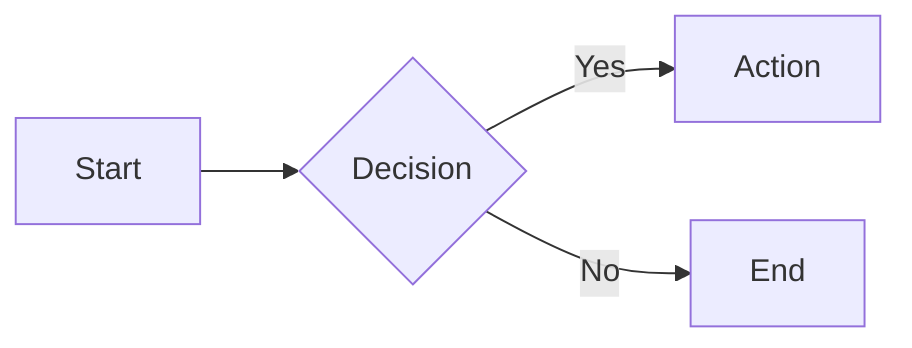
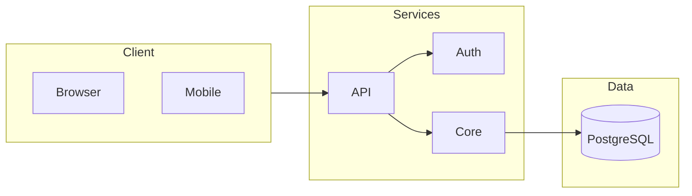
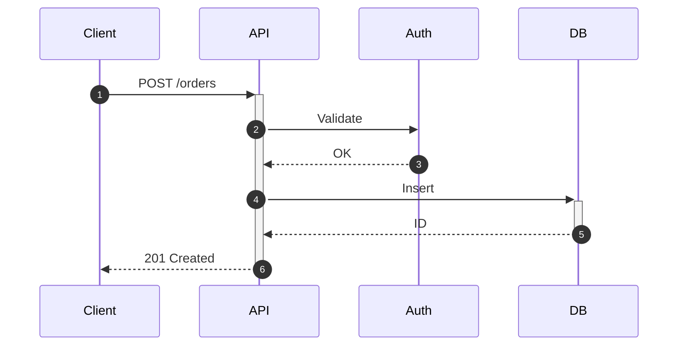
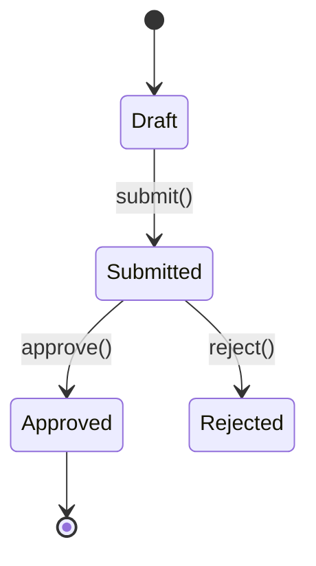

# Mermaid Diagrams

Generate diagrams in markdown that render in GitHub, GitLab, VS Code, Obsidian, Notion.

## Quick Start

````markdown

````

## Quick Decision Tree

```
What to visualize?
├─ Process, algorithm, decision flow    → flowchart
├─ API calls, service interactions      → sequenceDiagram
├─ Database tables, relationships       → erDiagram
├─ OOP, type hierarchy, domain model    → classDiagram
├─ State machine, lifecycle             → stateDiagram-v2
├─ System architecture, services        → flowchart + subgraphs (or C4Context)
├─ Project timeline, sprints            → gantt
├─ User experience, pain points         → journey
├─ Git branches                         → gitGraph
├─ Data distribution                    → pie
└─ Priority matrix                      → quadrantChart
```

## Diagram Types

| Type | Declaration | Best For |
|------|-------------|----------|
| **Flowchart** | `flowchart LR/TB` | Processes, decisions, data flow |
| **Sequence** | `sequenceDiagram` | API flows, service calls |
| **ER** | `erDiagram` | Database schemas |
| **Class** | `classDiagram` | Types, domain models |
| **State** | `stateDiagram-v2` | State machines |
| **Gantt** | `gantt` | Project timelines |
| **Journey** | `journey` | User experience |
| **C4** | `C4Context` | System architecture |
| **Git** | `gitGraph` | Branch visualization |

## Common Patterns

### System Architecture



### API Request Flow



### Database Schema

```mermaid
erDiagram
    USER ||--o{ ORDER : places
    ORDER ||--|{ LINE_ITEM : contains
    USER { uuid id PK; string email UK }
    ORDER { uuid id PK; uuid user_id FK }
```

### State Machine



## Syntax Quick Reference

### Flowchart Nodes

```
[Rectangle]  (Rounded)  {Diamond}  [(Database)]  [[Subroutine]]
((Circle))   >Asymmetric]   {{Hexagon}}
```

### Flowchart Edges

```
A --> B       # Arrow
A --- B       # Line
A -.-> B      # Dotted arrow
A ==> B       # Thick arrow
A -->|text| B # Labeled
```

### Sequence Arrows

```
->>   # Solid arrow (request)
-->>  # Dotted arrow (response)
-x    # X end (async)
-)    # Open arrow
```

### ER Cardinality

```
||--||   # One to one
||--o{   # One to many
}o--o{   # Many to many
```

## Best Practices

1. **Choose the right type** — Use decision tree above
2. **Keep focused** — One concept per diagram
3. **Use meaningful labels** — Not just A, B, C
4. **Direction matters** — `LR` for flows, `TB` for hierarchies
5. **Group with subgraphs** — Organize related nodes

## Reference Documentation

| File | Purpose |
|------|---------|
| [references/FLOWCHARTS.md](references/FLOWCHARTS.md) | Nodes, edges, subgraphs, styling |
| [references/SEQUENCE.md](references/SEQUENCE.md) | Participants, messages, activation |
| [references/CLASS-ER.md](references/CLASS-ER.md) | Classes, ER diagrams, relationships |
| [references/STATE-JOURNEY.md](references/STATE-JOURNEY.md) | States, user journeys |
| [references/DATA-CHARTS.md](references/DATA-CHARTS.md) | Gantt, Pie, Timeline, Quadrant |
| [references/ARCHITECTURE.md](references/ARCHITECTURE.md) | C4, Block, Kanban |
| [references/CHEATSHEET.md](references/CHEATSHEET.md) | All syntax quick reference |

## Resources

- **Official Documentation**: https://mermaid.js.org
- **Live Editor**: https://mermaid.live
- **GitHub Repository**: https://github.com/mermaid-js/mermaid
- **GitHub Markdown Support**: https://docs.github.com/en/get-started/writing-on-github/working-with-advanced-formatting/creating-diagrams
- **GitLab Markdown Support**: https://docs.gitlab.com/ee/user/markdown.html#diagrams-and-flowcharts
