# Advanced Configuration & Styling

Theming, configuration, custom styling, and troubleshooting for Mermaid diagrams.

---

# Configuration

## Init Directive

Configure diagrams using the init directive:

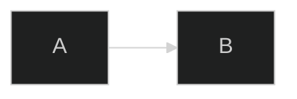

## Multi-Line Configuration


---

# Themes

## Built-in Themes

| Theme | Description |
|-------|-------------|
| `default` | Default blue theme |
| `dark` | Dark mode |
| `forest` | Green nature theme |
| `neutral` | Grayscale |
| `base` | Base for customization |

### Usage

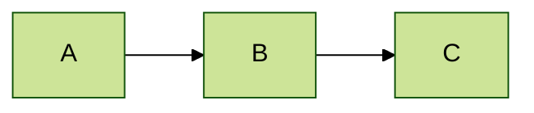

---

# Theme Variables

## Core Variables

| Variable | Description |
|----------|-------------|
| `primaryColor` | Main node color |
| `primaryTextColor` | Text in primary nodes |
| `primaryBorderColor` | Primary node border |
| `secondaryColor` | Secondary elements |
| `tertiaryColor` | Tertiary/background |
| `lineColor` | Edge/arrow color |
| `textColor` | General text |
| `background` | Diagram background |

## Typography

| Variable | Description |
|----------|-------------|
| `fontSize` | Base font size |
| `fontFamily` | Font family |

---

## Custom Theme Example

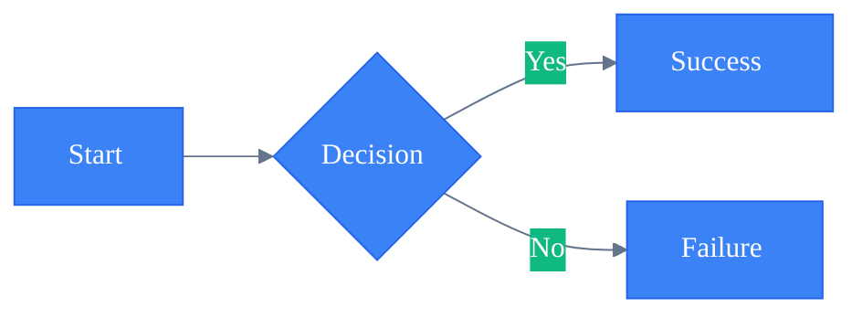

---

## Diagram-Specific Variables

### Flowchart

| Variable | Description |
|----------|-------------|
| `nodeBorder` | Node border color |
| `nodeTextColor` | Node text |
| `clusterBkg` | Subgraph background |
| `clusterBorder` | Subgraph border |
| `edgeLabelBackground` | Edge label background |

### Sequence Diagram

| Variable | Description |
|----------|-------------|
| `actorBorder` | Actor border |
| `actorBkg` | Actor background |
| `actorTextColor` | Actor text |
| `activationBorderColor` | Activation border |
| `activationBkgColor` | Activation background |
| `signalColor` | Arrow/signal color |
| `signalTextColor` | Message text |
| `noteBkgColor` | Note background |
| `noteBorderColor` | Note border |
| `noteTextColor` | Note text |

### State Diagram

| Variable | Description |
|----------|-------------|
| `labelColor` | State label |
| `altBackground` | Composite state background |

### Gantt Chart

| Variable | Description |
|----------|-------------|
| `gridColor` | Grid lines |
| `todayLineColor` | Today marker |
| `taskTextColor` | Task text |
| `doneTaskBkgColor` | Completed task |
| `activeTaskBkgColor` | Active task |
| `critBkgColor` | Critical path |
| `taskBorderColor` | Task border |

---

# Styling

## Class-Based Styling

### Define Classes


### Apply to Multiple Nodes

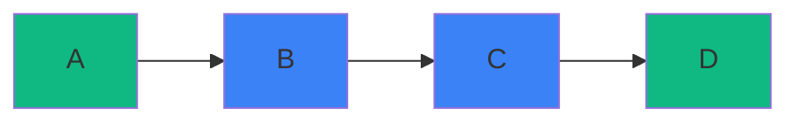

### Default Class

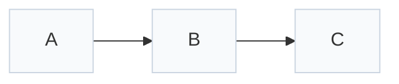

---

## Individual Node Styling


### Style Properties

| Property | Example |
|----------|---------|
| `fill` | `fill:#3b82f6` |
| `stroke` | `stroke:#2563eb` |
| `stroke-width` | `stroke-width:2px` |
| `stroke-dasharray` | `stroke-dasharray:5,5` |
| `color` | `color:white` |
| `font-weight` | `font-weight:bold` |

---

## Link Styling

### Individual Links

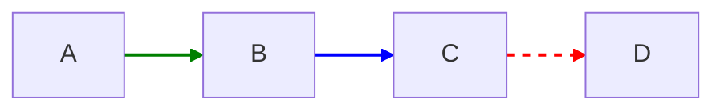

### All Links

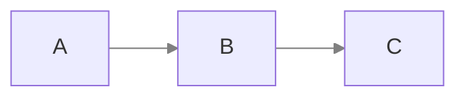

---

# Layout Engine

## ELK Renderer

For complex diagrams (v9.4+):

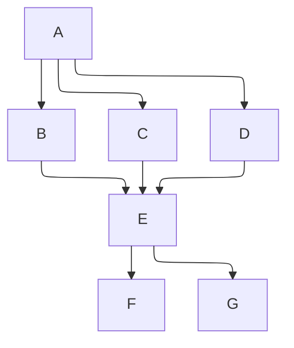

Benefits:
- Better handling of complex layouts
- More predictable edge routing
- Improved subgraph positioning

---

# Security Levels

Control what Mermaid can do:

| Level | Description |
|-------|-------------|
| `strict` | Most secure, no HTML/JS |
| `loose` | Allows some interaction |
| `antiscript` | Allows HTML, blocks scripts |
| `sandbox` | iframe sandbox |

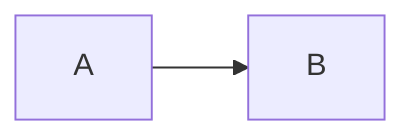

---

# Troubleshooting

## Common Issues

### Special Characters

Escape with HTML entities or quotes:

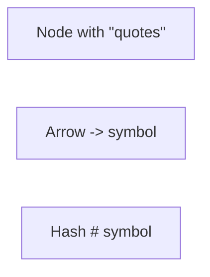

### HTML Entities

| Char | Entity |
|------|--------|
| `#` | `#35;` |
| `"` | `#quot;` |
| `<` | `#lt;` |
| `>` | `#gt;` |
| `&` | `#amp;` |
| `{` | `#123;` |
| `}` | `#125;` |

### Long Labels

Use markdown strings:

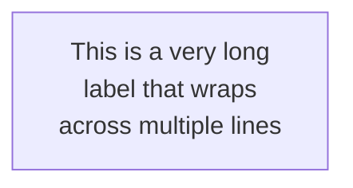

---

## Debugging Tips

### 1. Check Syntax
- Verify diagram type declaration
- Check for unclosed brackets/quotes
- Ensure arrow syntax matches diagram type

### 2. Test Incrementally
- Start with minimal diagram
- Add elements one at a time
- Identify breaking change

### 3. Use Live Editor
Test at: https://mermaid.live

### 4. Platform Differences
- Check target platform support
- Some features are version-specific
- Export to PNG/SVG for guaranteed rendering

---

## Arrow Syntax by Diagram Type

| Diagram | Sync | Async | Dotted |
|---------|------|-------|--------|
| Flowchart | `-->` | N/A | `-.->` |
| Sequence | `->>` | `-->>` | `-->>` |
| Class | `-->` | N/A | `..>` |
| State | `-->` | N/A | N/A |

---

# Frontmatter Configuration

Alternative to init directive:

```yaml
---
title: My Diagram
config:
  theme: forest
  flowchart:
    defaultRenderer: elk
---
```


---

# Directive Reference

## Diagram Directives

| Diagram | Directive |
|---------|-----------|
| All | `%%{init: {...}}%%` |
| Flowchart | `flowchart` config |
| Sequence | `sequenceDiagram` config |
| Class | `classDiagram` config |
| State | `stateDiagram` config |
| ER | `erDiagram` config |
| Gantt | `gantt` config |

## Common Init Options

```javascript
%%{init: {
  'theme': 'default',
  'themeVariables': { ... },
  'flowchart': {
    'defaultRenderer': 'elk',
    'curve': 'basis',
    'padding': 15
  },
  'sequence': {
    'showSequenceNumbers': true,
    'actorMargin': 50,
    'boxMargin': 10
  },
  'gantt': {
    'barHeight': 20,
    'fontSize': 11,
    'sectionFontSize': 14
  }
}}%%
```

---

# Accessibility

## Alt Text

For screen readers, provide context before diagrams:

```markdown
The following diagram shows the authentication flow:

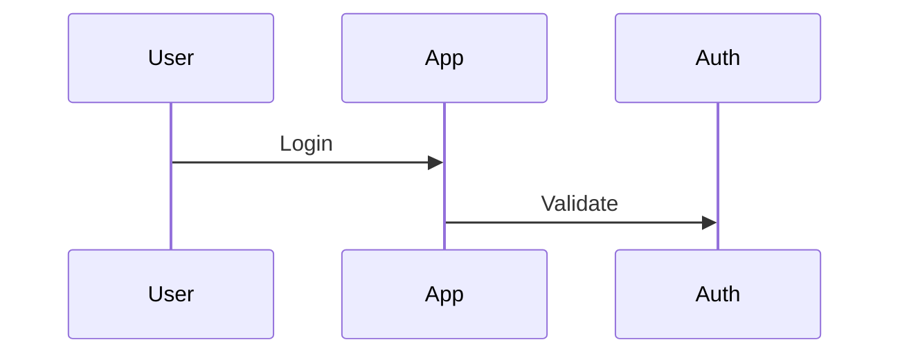
```

## ARIA Labels

When embedding in HTML:

```html
<div class="mermaid" role="img" aria-label="Authentication flow diagram">
  sequenceDiagram
    User->>App: Login
</div>
```

---

# Performance Tips

1. **Limit complexity** - Split large diagrams
2. **Use ELK** for complex layouts
3. **Minimize styling** - Class-based over inline
4. **Cache renders** when possible
5. **Lazy load** in documentation

---

# Export Options

## From Live Editor

- PNG (transparent or white background)
- SVG (scalable)
- Markdown

## Programmatic

```javascript
import mermaid from 'mermaid';

const svg = await mermaid.render('id', diagramText);
```

## CLI

```bash
npx @mermaid-js/mermaid-cli -i input.md -o output.svg
```
