# Architecture Diagrams

Mermaid provides several diagram types for system architecture: Architecture diagrams, Block diagrams, C4 diagrams, and Kanban boards.

---

# Architecture Diagrams

Cloud and CI/CD infrastructure visualization using icons and groups.

## Basic Syntax

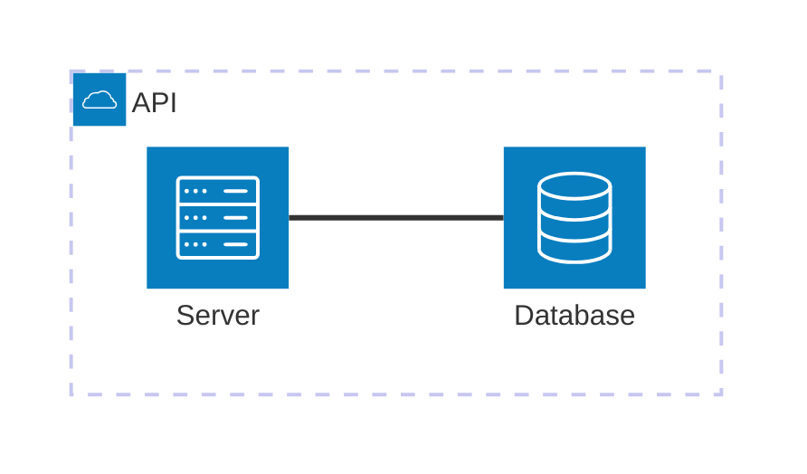

---

## Components

### Groups

Organize services logically:

```
group {id}({icon})[{title}]
group {id}({icon})[{title}] in {parent_id}
```

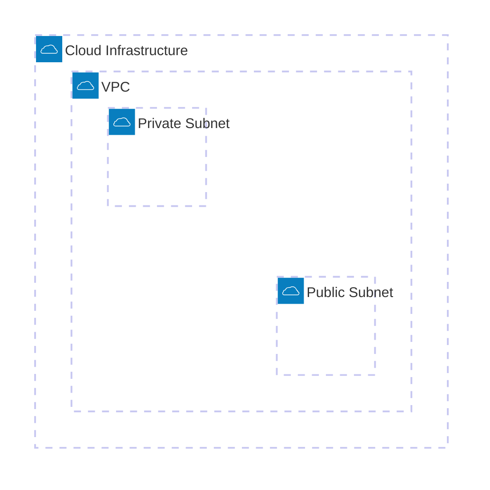

### Services

Individual components:

```
service {id}({icon})[{title}]
service {id}({icon})[{title}] in {group_id}
```

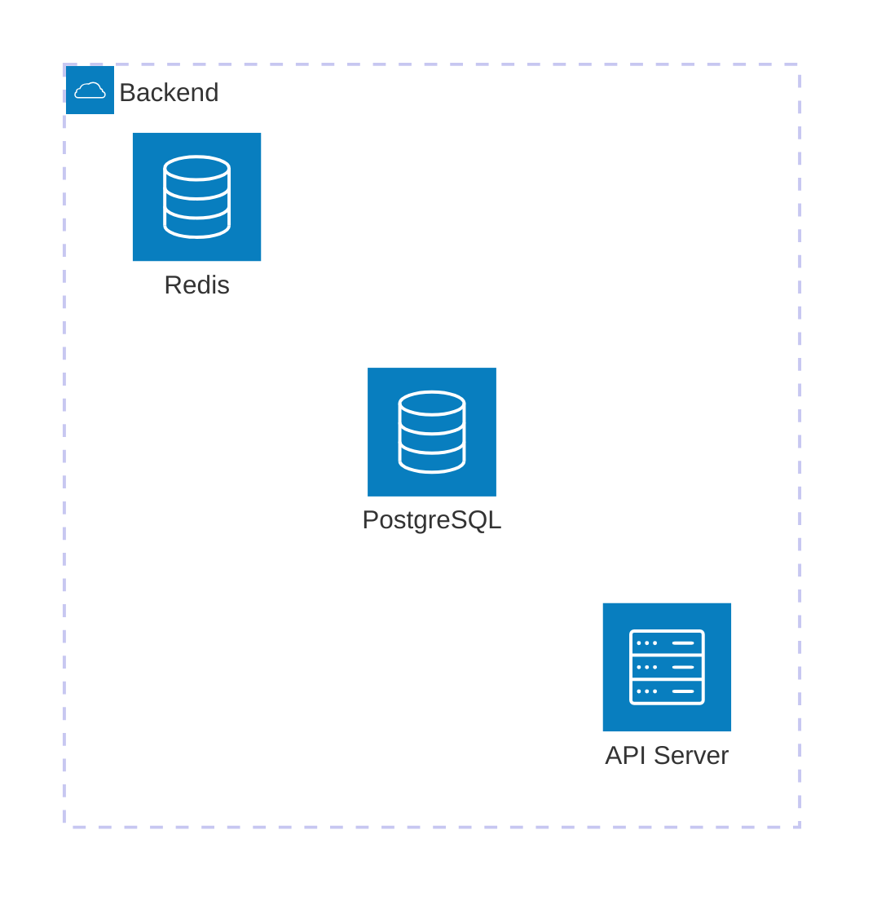

### Junctions

4-way connection points:

```
junction {id}
junction {id} in {group_id}
```

---

## Edges

Connect components with directional flow:

```
{service}:{direction} {arrow} {direction}:{service}
```

### Directions

| Code | Position |
|------|----------|
| `T` | Top |
| `B` | Bottom |
| `L` | Left |
| `R` | Right |

### Arrow Types

| Syntax | Description |
|--------|-------------|
| `--` | Undirected |
| `-->` | Arrow to right |
| `<--` | Arrow to left |
| `<-->` | Bidirectional |

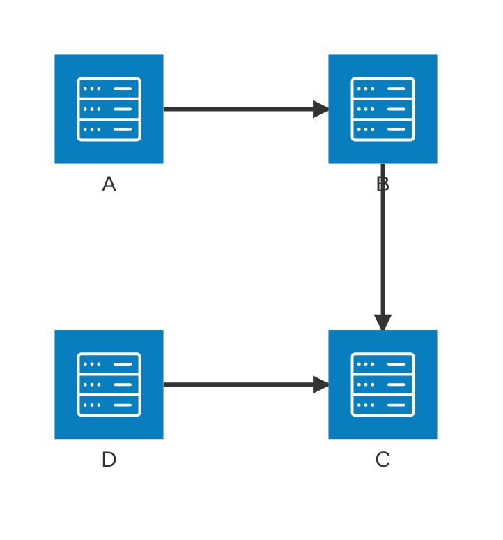

---

## Icons

### Default Icons

| Icon | Description |
|------|-------------|
| `cloud` | Cloud |
| `database` | Database |
| `disk` | Disk storage |
| `internet` | Internet/globe |
| `server` | Server |

### Iconify Icons

Access 200,000+ icons from iconify.design:

```mermaid
architecture-beta
    service aws(logos:aws)[AWS]
    service gcp(logos:google-cloud)[GCP]
```

---

## Example: Microservices Architecture

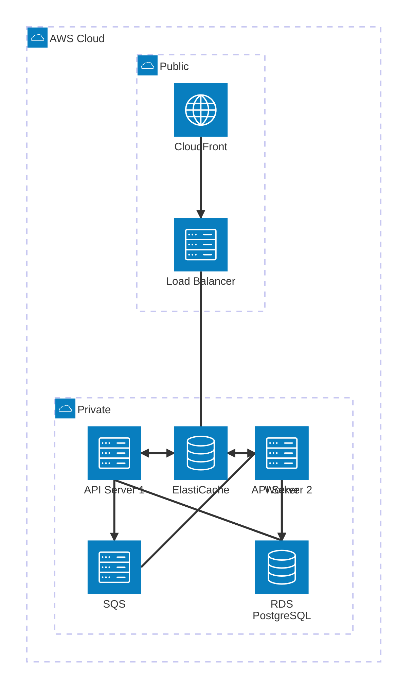

---

# Block Diagrams

System component layouts with flexible positioning.

## Basic Syntax

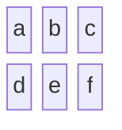

---

## Columns

Control layout width:

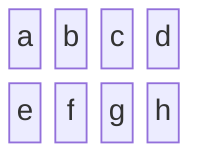

## Block Width (Spanning)

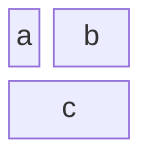

## Block Shapes

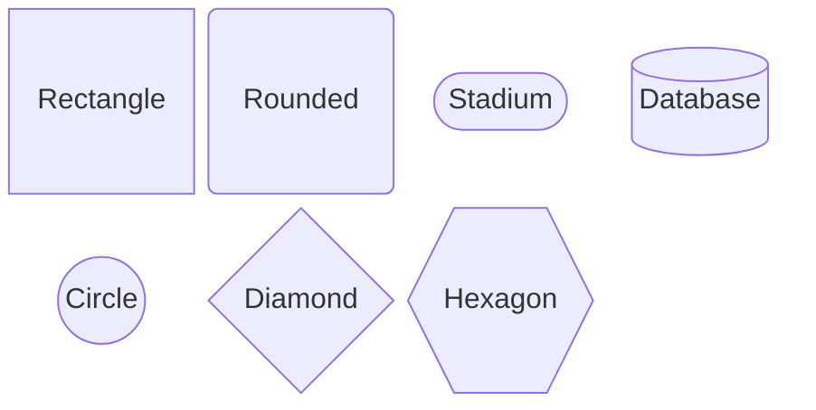

---

## Nested Blocks

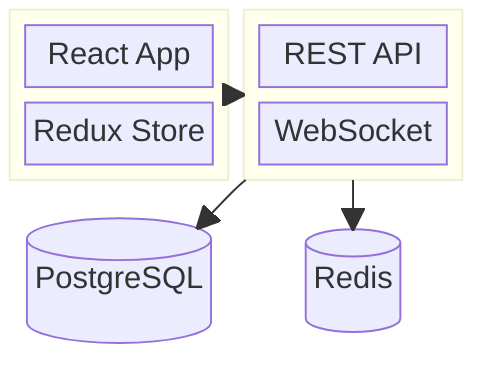

---

## Connections

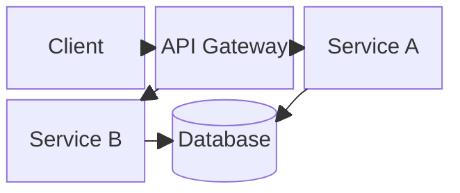

---

## Styling

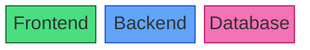

---

## Example: Three-Tier Architecture

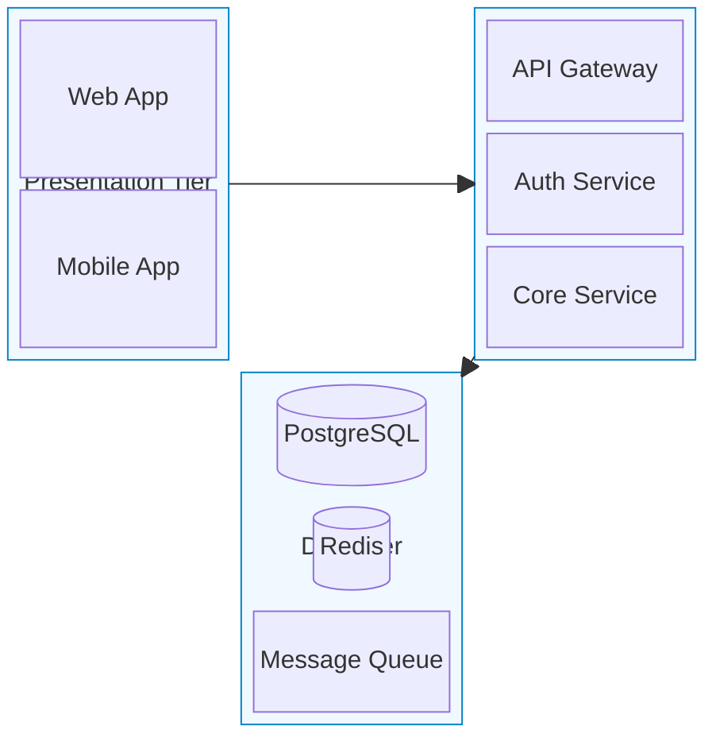

---

# C4 Diagrams

Software architecture using the C4 model (Context, Container, Component, Code).

## Diagram Types

| Type | Declaration | Level |
|------|-------------|-------|
| System Context | `C4Context` | 1 - Highest |
| Container | `C4Container` | 2 |
| Component | `C4Component` | 3 |
| Dynamic | `C4Dynamic` | Interactions |
| Deployment | `C4Deployment` | Infrastructure |

---

## C4Context (Level 1)

Shows system in context with users and external systems:

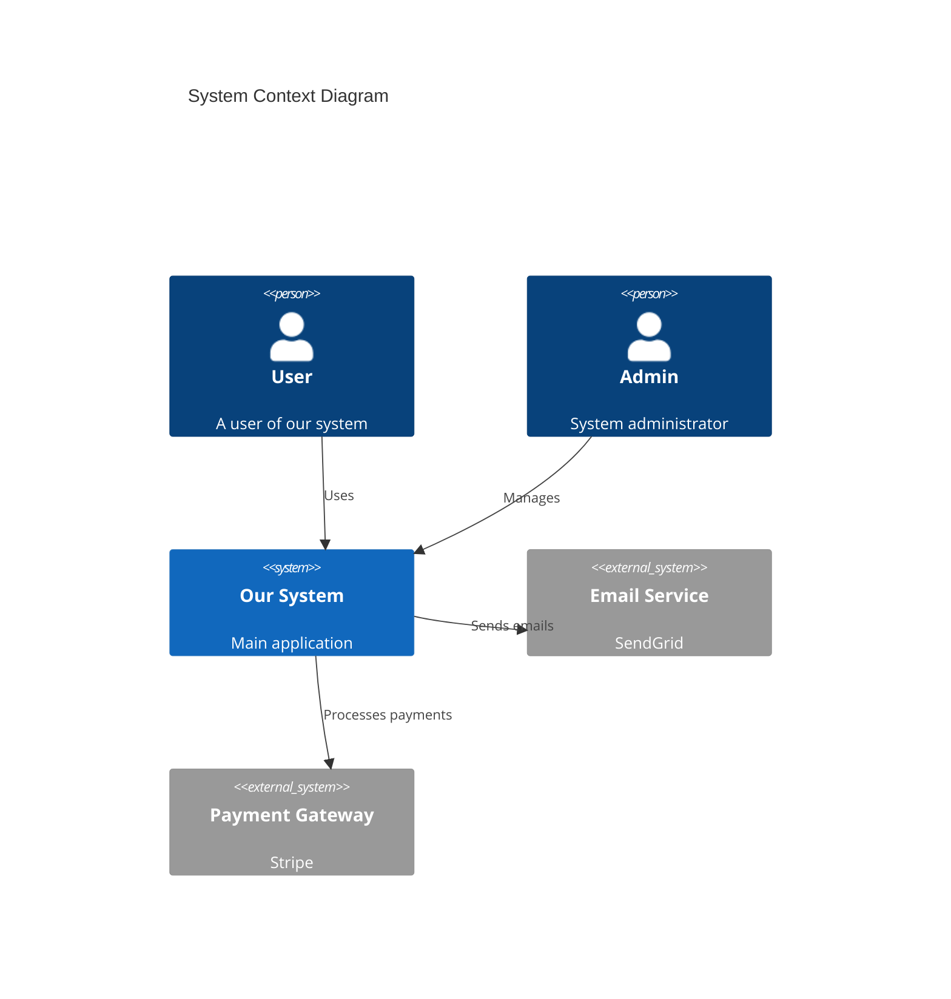

### Elements

| Function | Description |
|----------|-------------|
| `Person(alias, label, desc)` | User/actor |
| `Person_Ext()` | External person |
| `System(alias, label, desc)` | Software system |
| `System_Ext()` | External system |
| `SystemDb()` | Database system |
| `SystemQueue()` | Queue system |
| `Boundary(alias, label)` | Grouping boundary |
| `Enterprise_Boundary()` | Enterprise scope |

---

## C4Container (Level 2)

Shows containers within the system:

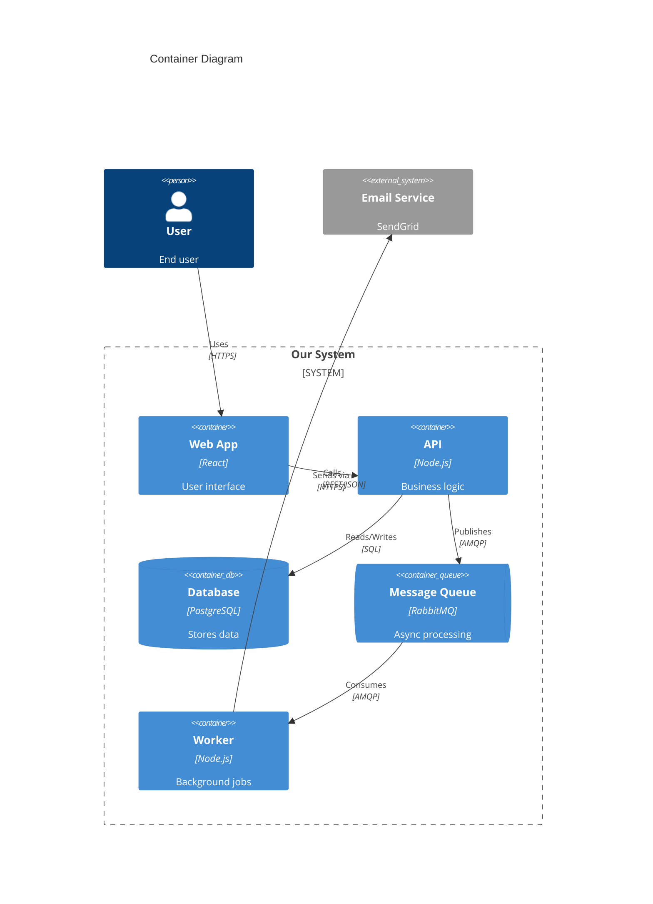

### Container Elements

| Function | Description |
|----------|-------------|
| `Container(alias, label, tech, desc)` | Container |
| `Container_Ext()` | External container |
| `ContainerDb()` | Database container |
| `ContainerQueue()` | Queue container |
| `Container_Boundary()` | Container grouping |

---

## C4Component (Level 3)

Shows components within a container:

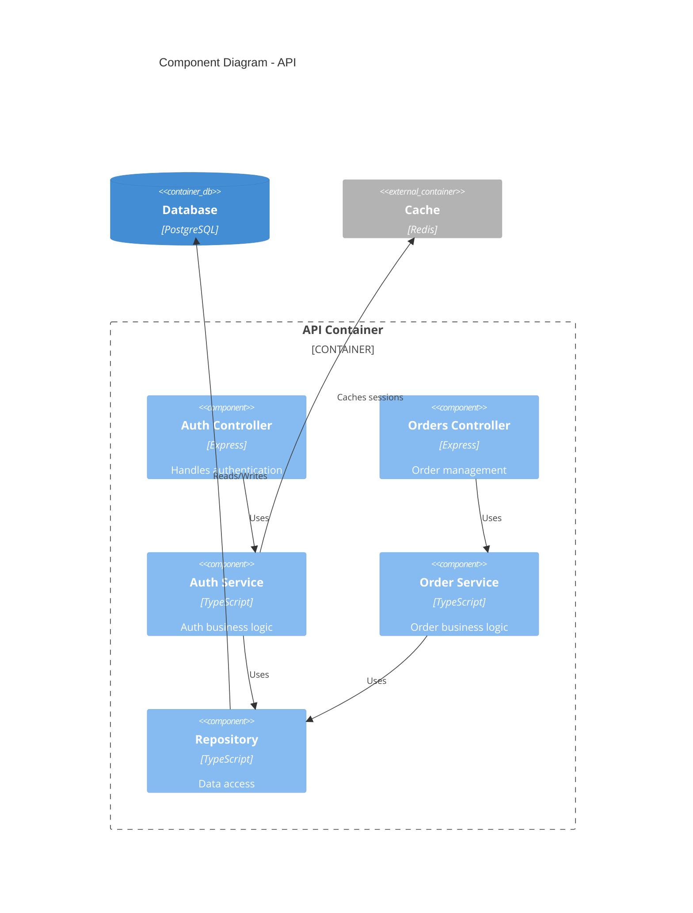

---

## C4Dynamic

Shows runtime interactions:

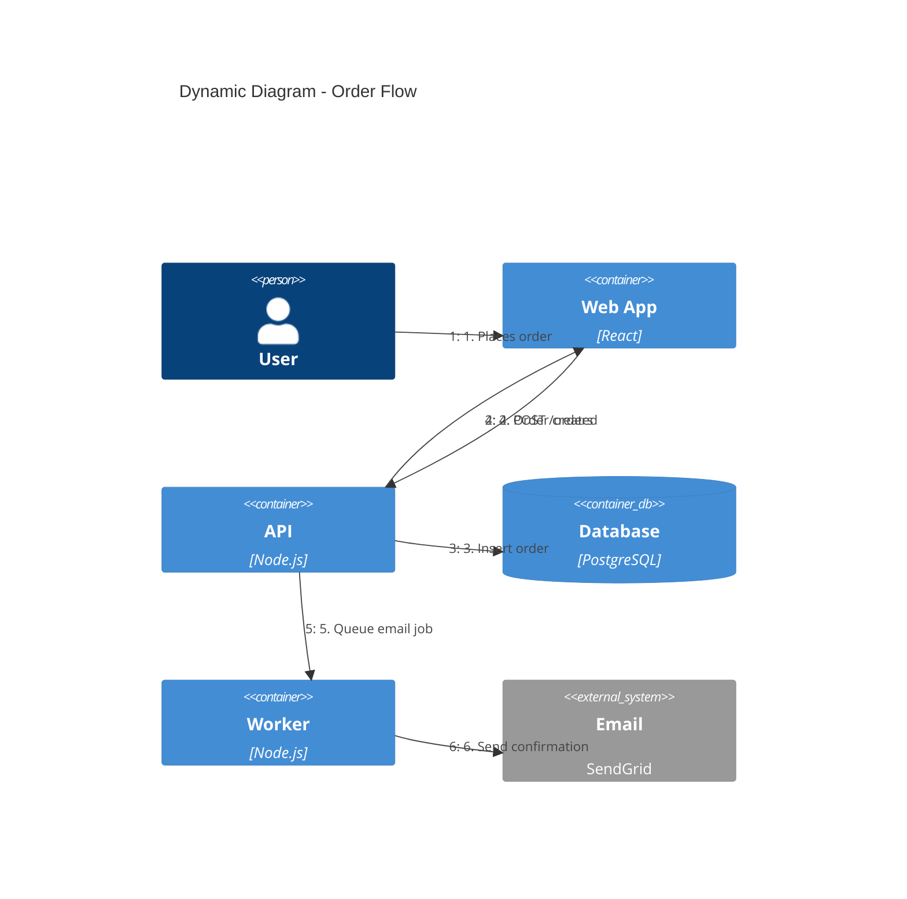

---

## C4Deployment

Shows deployment to infrastructure:

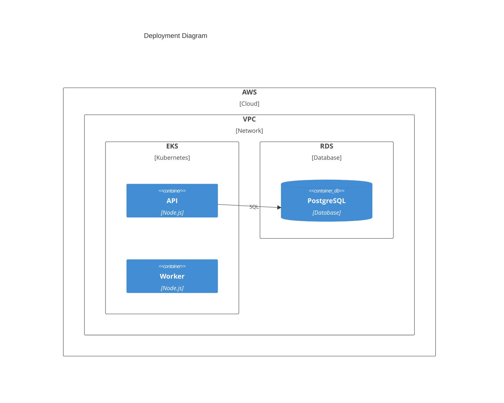

---

## Relationships

| Function | Description |
|----------|-------------|
| `Rel(from, to, label)` | Relationship |
| `Rel(from, to, label, tech)` | With technology |
| `BiRel()` | Bidirectional |
| `Rel_U()`, `Rel_D()`, `Rel_L()`, `Rel_R()` | Directional |
| `Rel_Back()` | Reverse direction |

---

## Styling

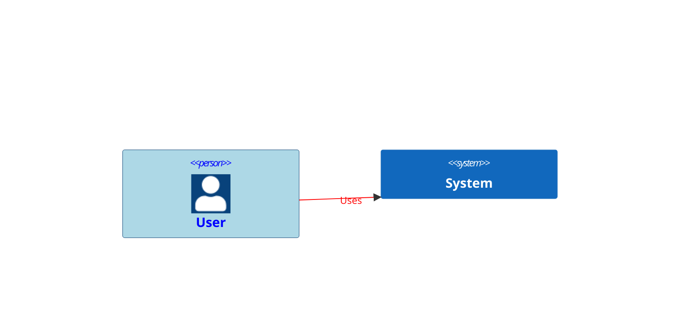

---

# Kanban Diagrams

Workflow boards for task management.

## Basic Syntax

```mermaid
kanban
    Todo
        task1[Design API]
        task2[Write tests]
    In Progress
        task3[Implement auth]
    Done
        task4[Setup project]
```

---

## Task Metadata

```mermaid
kanban
    Backlog
        task1[User authentication]
        @{ ticket: AUTH-123 }
        @{ assigned: john }
        @{ priority: High }
```

### Metadata Keys

| Key | Description |
|-----|-------------|
| `ticket` | Issue/ticket number |
| `assigned` | Assignee |
| `priority` | Priority level |

---

## Configuration

```yaml
---
config:
  kanban:
    ticketBaseUrl: 'https://jira.example.com/browse/#TICKET#'
---
```

---

## Example: Sprint Board

```mermaid
kanban
    Backlog
        story1[User login]
        story2[Password reset]
        story3[OAuth integration]

    Todo
        task1[Design login form]
        task2[Setup JWT auth]

    In Progress
        task3[Implement login API]
        @{ assigned: alice }
        task4[Write login tests]
        @{ assigned: bob }

    Review
        task5[Database schema]
        @{ assigned: charlie }

    Done
        task6[Project setup]
        task7[CI/CD pipeline]
```

---

# Packet Diagrams

Network protocol visualization.

## Basic Syntax

```mermaid
packet-beta
    0-15: "Source Port"
    16-31: "Destination Port"
    32-63: "Sequence Number"
```

## Bit Ranges

Two syntaxes:
- Absolute: `0-15: "Field"`
- Relative: `+16: "Field"` (16 bits from current position)

---

## Example: TCP Packet

```mermaid
packet-beta
    0-15: "Source Port"
    16-31: "Destination Port"
    32-63: "Sequence Number"
    64-95: "Acknowledgment Number"
    96-99: "Data Offset"
    100-105: "Reserved"
    106: "URG"
    107: "ACK"
    108: "PSH"
    109: "RST"
    110: "SYN"
    111: "FIN"
    112-127: "Window"
    128-143: "Checksum"
    144-159: "Urgent Pointer"
    160-191: "(Options)"
    192-255: "Data"
```

## Example: UDP Packet

```mermaid
packet-beta
    title UDP Packet
    +16: "Source Port"
    +16: "Destination Port"
    +16: "Length"
    +16: "Checksum"
    +64: "Data"
```

---

# Requirement Diagrams

System requirements and traceability.

## Basic Syntax

```mermaid
requirementDiagram

    requirement user_login {
        id: REQ-001
        text: Users must be able to log in
        risk: low
        verifymethod: test
    }

    element login_page {
        type: ui_component
        docref: UI-001
    }

    login_page - satisfies -> user_login
```

## Requirement Types

| Type | Description |
|------|-------------|
| `requirement` | Generic |
| `functionalRequirement` | Functional |
| `interfaceRequirement` | Interface |
| `performanceRequirement` | Performance |
| `physicalRequirement` | Physical |
| `designConstraint` | Constraint |

## Relationships

| Type | Meaning |
|------|---------|
| `contains` | Parent contains child |
| `copies` | Duplicate |
| `derives` | Derives from |
| `satisfies` | Element satisfies requirement |
| `verifies` | Element verifies requirement |
| `refines` | Refines requirement |
| `traces` | Traceability link |

---

## Example: Feature Requirements

```mermaid
requirementDiagram

    requirement auth_system {
        id: REQ-100
        text: System shall provide user authentication
        risk: high
        verifymethod: test
    }

    functionalRequirement login {
        id: REQ-101
        text: Users can log in with email/password
        risk: medium
        verifymethod: test
    }

    functionalRequirement mfa {
        id: REQ-102
        text: System shall support MFA
        risk: high
        verifymethod: demonstration
    }

    element auth_service {
        type: service
        docref: SVC-001
    }

    element auth_tests {
        type: test_suite
        docref: TEST-001
    }

    auth_system - contains -> login
    auth_system - contains -> mfa
    auth_service - satisfies -> login
    auth_service - satisfies -> mfa
    auth_tests - verifies -> login
    auth_tests - verifies -> mfa
```
