# Class & Entity Relationship Diagrams

Class diagrams model object-oriented structures. ER diagrams model database schemas and data relationships.

---

# Class Diagrams

## Basic Syntax

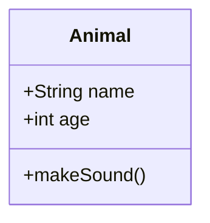

---

## Class Definition

### Attributes and Methods

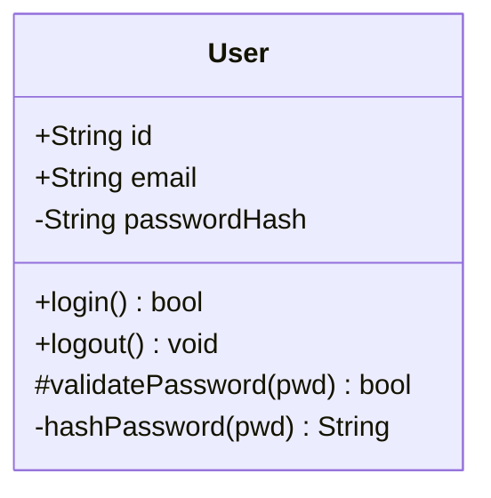

### Visibility Modifiers

| Symbol | Visibility |
|--------|------------|
| `+` | Public |
| `-` | Private |
| `#` | Protected |
| `~` | Package/Internal |

### Return Types

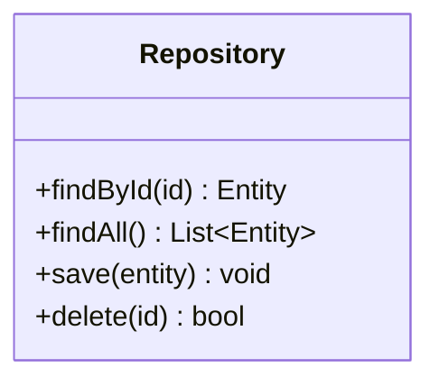

---

## Relationships

### Relationship Types

| Syntax | Relationship |
|--------|--------------|
| `<\|--` | Inheritance (extends) |
| `*--` | Composition (owns) |
| `o--` | Aggregation (has) |
| `-->` | Association |
| `..>` | Dependency |
| `..\|>` | Realization (implements) |
| `--` | Link (solid) |
| `..` | Link (dashed) |

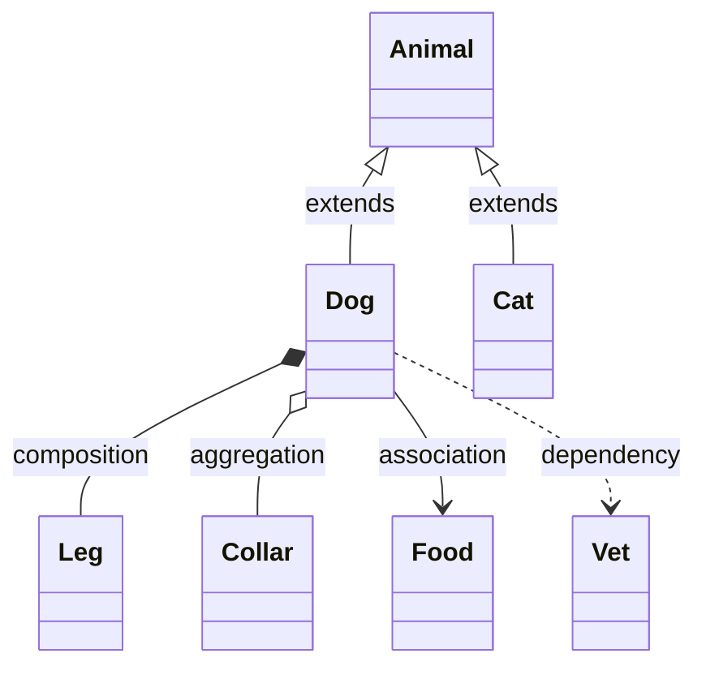

### Cardinality

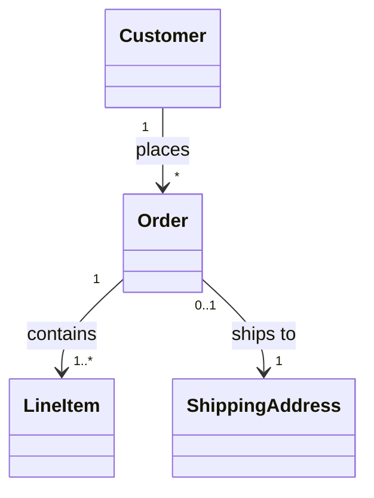

| Notation | Meaning |
|----------|---------|
| `1` | Exactly one |
| `0..1` | Zero or one |
| `1..*` | One or more |
| `*` | Many (zero or more) |
| `n` | Specific number |
| `0..n` | Zero to n |

---

## Annotations

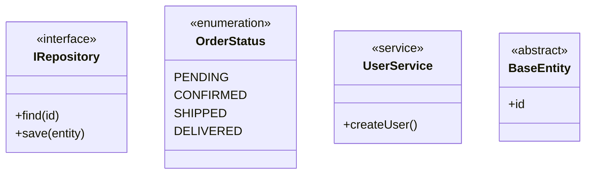

---

## Generic Types

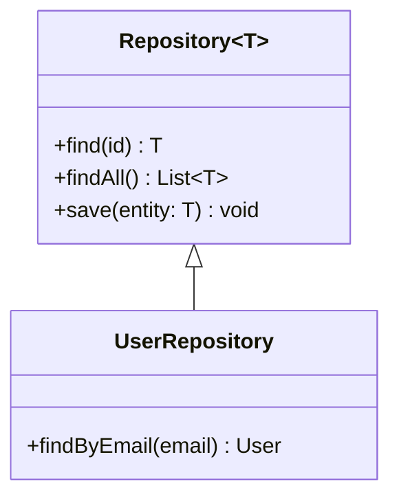

---

## Namespaces

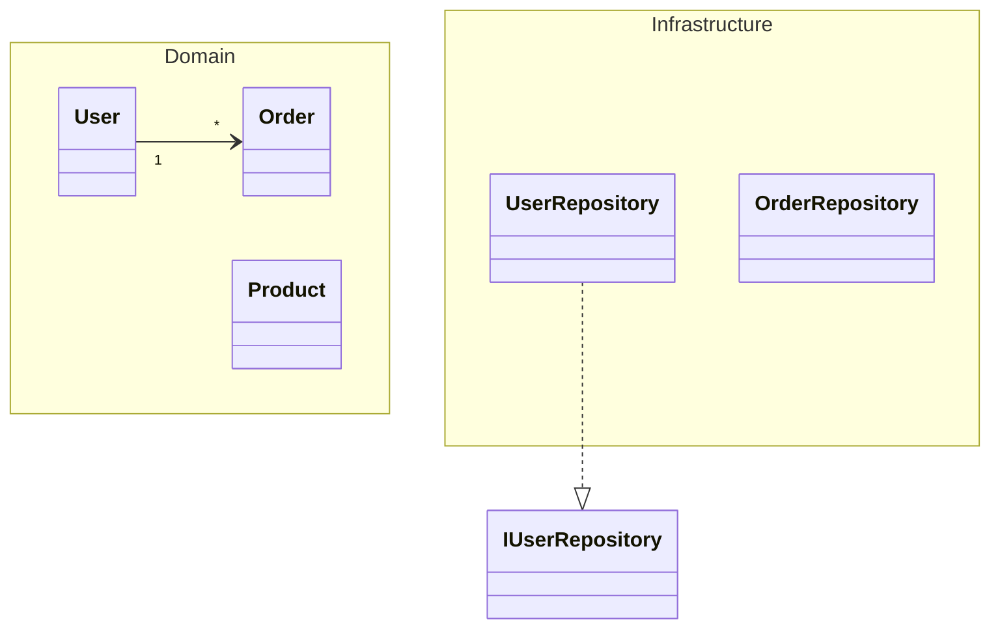

---

## Notes

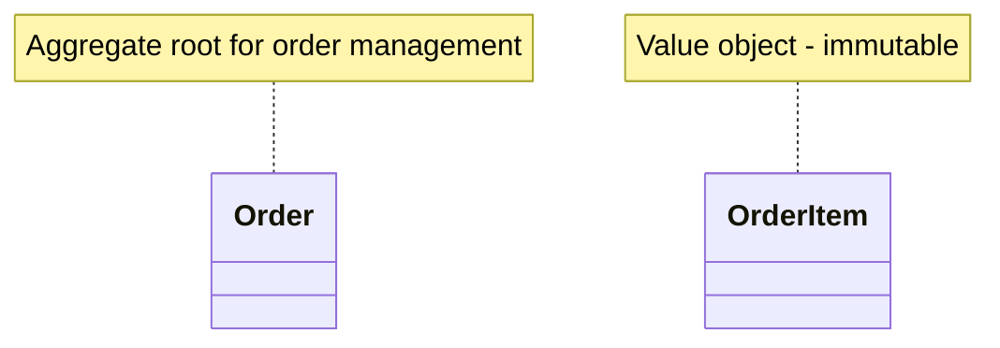

---

## Styling

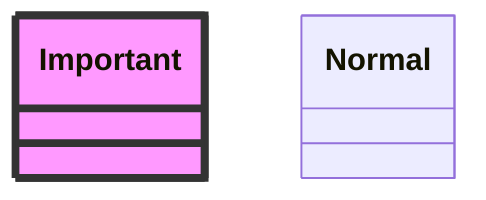

---

## Example: Domain Model

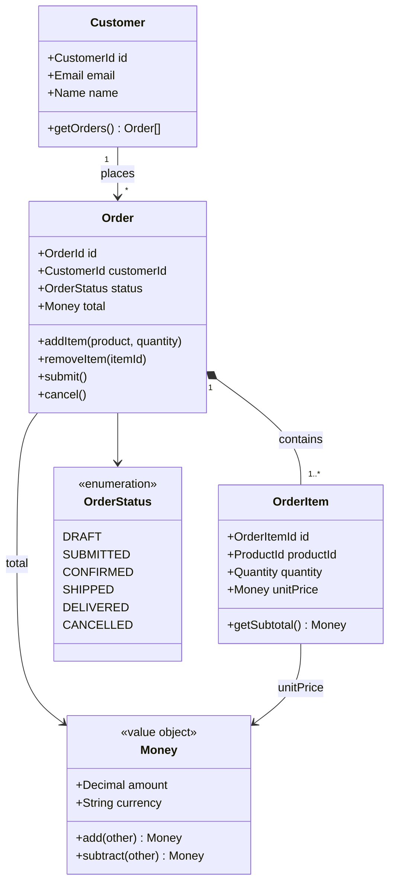

---

# Entity Relationship Diagrams

## Basic Syntax

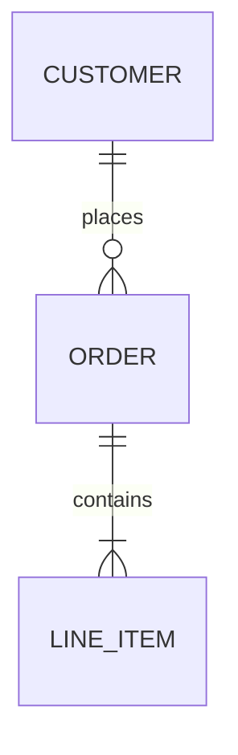

---

## Relationship Notation (Crow's Foot)

### Cardinality Symbols

| Left | Right | Meaning |
|------|-------|---------|
| `\|o` | `o\|` | Zero or one |
| `\|\|` | `\|\|` | Exactly one |
| `}o` | `o{` | Zero or more |
| `}\|` | `\|{` | One or more |

### Line Types

| Type | Syntax | Meaning |
|------|--------|---------|
| Identifying | `--` | Strong relationship |
| Non-identifying | `..` | Weak relationship |

### Common Patterns

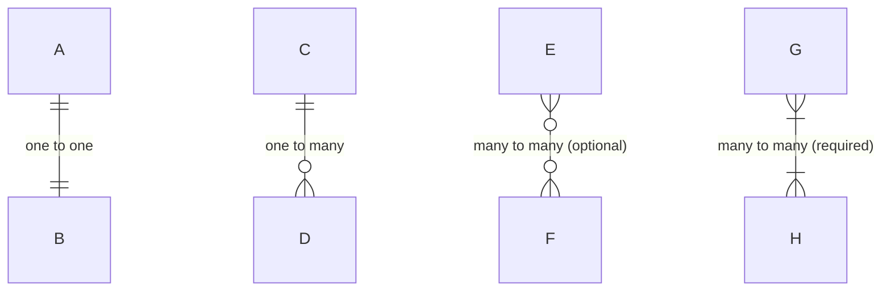

---

## Entity Attributes

### Basic Attributes

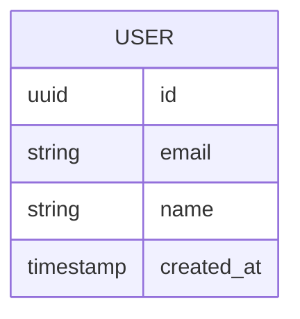

### Attribute Modifiers

| Modifier | Meaning |
|----------|---------|
| `PK` | Primary Key |
| `FK` | Foreign Key |
| `UK` | Unique Key |

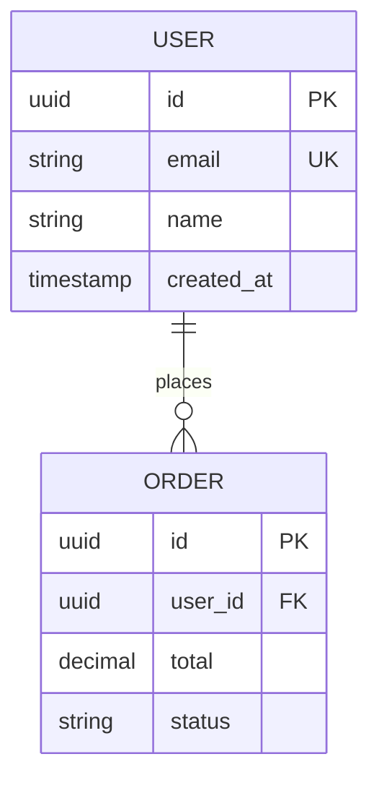

### Attribute Comments

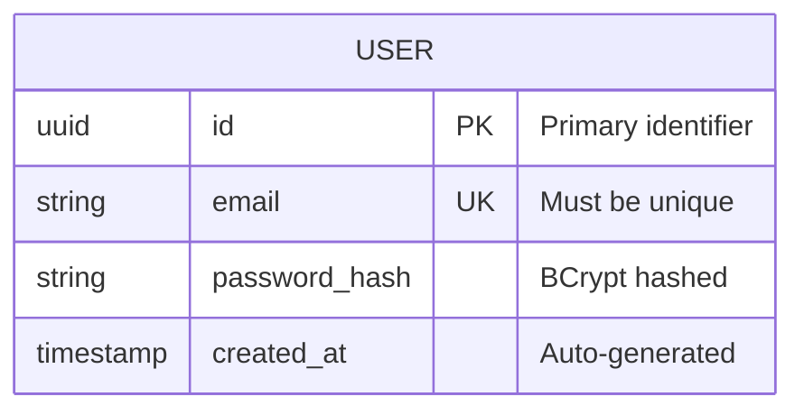

---

## Relationship Labels

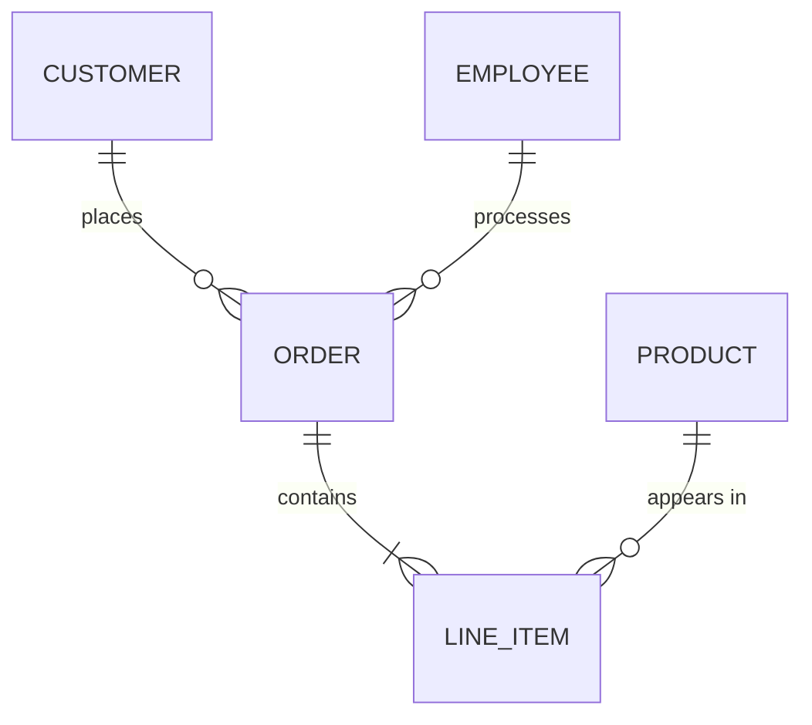

---

## Example: E-Commerce Schema

```mermaid
erDiagram
    USER ||--o{ ORDER : places
    USER ||--o{ ADDRESS : has
    USER ||--o{ CART : has
    ORDER ||--|{ ORDER_ITEM : contains
    ORDER ||--o| SHIPPING : "shipped via"
    ORDER }o--|| ADDRESS : "ships to"
    PRODUCT ||--o{ ORDER_ITEM : "ordered as"
    PRODUCT ||--o{ CART_ITEM : "added to"
    PRODUCT }o--|| CATEGORY : "belongs to"
    CART ||--|{ CART_ITEM : contains

    USER {
        uuid id PK
        string email UK
        string password_hash
        string name
        boolean is_active
        timestamp created_at
        timestamp updated_at
    }

    ADDRESS {
        uuid id PK
        uuid user_id FK
        string street
        string city
        string state
        string postal_code
        string country
        boolean is_default
    }

    PRODUCT {
        uuid id PK
        uuid category_id FK
        string sku UK
        string name
        text description
        decimal price
        integer stock_quantity
        boolean is_active
    }

    CATEGORY {
        uuid id PK
        uuid parent_id FK
        string name
        string slug UK
    }

    ORDER {
        uuid id PK
        uuid user_id FK
        uuid shipping_address_id FK
        string status
        decimal subtotal
        decimal tax
        decimal shipping_cost
        decimal total
        timestamp created_at
    }

    ORDER_ITEM {
        uuid id PK
        uuid order_id FK
        uuid product_id FK
        integer quantity
        decimal unit_price
        decimal subtotal
    }

    CART {
        uuid id PK
        uuid user_id FK UK
        timestamp updated_at
    }

    CART_ITEM {
        uuid id PK
        uuid cart_id FK
        uuid product_id FK
        integer quantity
    }

    SHIPPING {
        uuid id PK
        uuid order_id FK UK
        string carrier
        string tracking_number
        string status
        timestamp shipped_at
        timestamp delivered_at
    }
```

---

## Example: Multi-Tenant SaaS

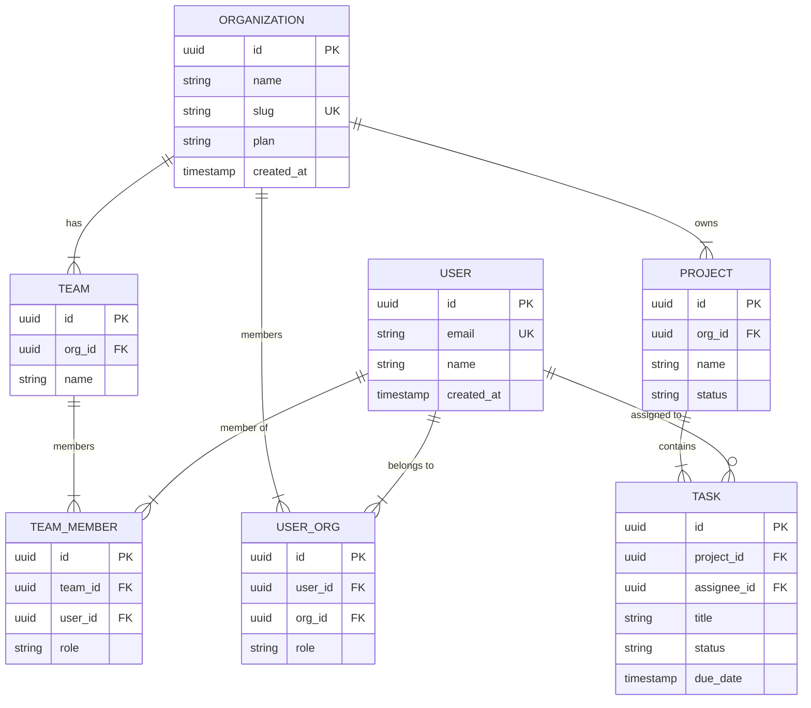
