# Data Charts & Timelines

Mermaid supports various chart types for data visualization, project planning, and chronological representation.

---

# Gantt Charts

Project scheduling and timeline visualization.

## Basic Syntax

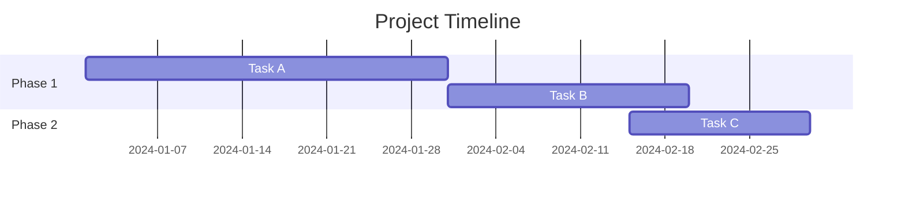
```mermaid
gantt
    title Project Timeline
    dateFormat YYYY-MM-DD

    section Phase 1
    Task A           :a1, 2024-01-01, 30d
    Task B           :a2, after a1, 20d

    section Phase 2
    Task C           :2024-02-15, 15d
```

---

## Configuration

### Date Formats

| Format | Example |
|--------|---------|
| `YYYY-MM-DD` | 2024-01-15 |
| `DD/MM/YYYY` | 15/01/2024 |
| `MM-DD-YYYY` | 01-15-2024 |

### Axis Format

Control how dates appear on the axis:

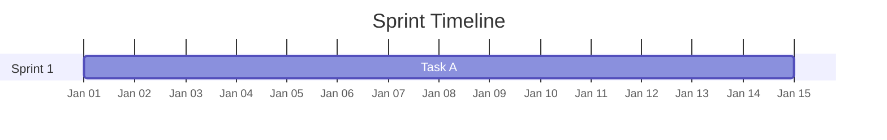
```mermaid
gantt
    dateFormat YYYY-MM-DD
    axisFormat %b %d
    title Sprint Timeline

    section Sprint 1
    Task A : 2024-01-01, 14d
```

Common format codes:
- `%Y` - Year (2024)
- `%m` - Month (01-12)
- `%b` - Month abbr (Jan)
- `%d` - Day (01-31)
- `%a` - Weekday abbr (Mon)

---

## Task Syntax

```
Task name : [tags], [id], [start], [end/duration]
```

### Task Tags

| Tag | Effect |
|-----|--------|
| `done` | Completed (grayed) |
| `active` | In progress |
| `crit` | Critical path (red) |
| `milestone` | Milestone marker |

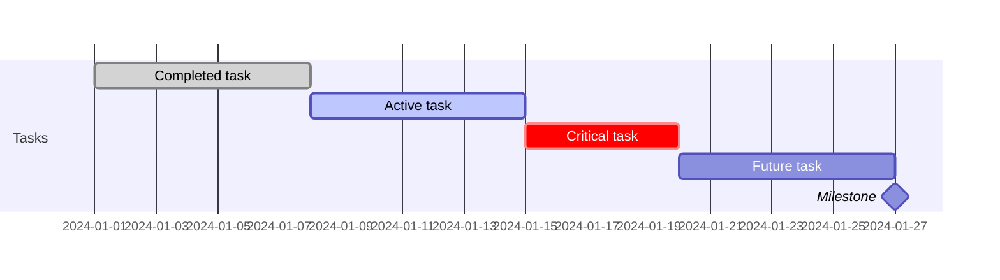
```mermaid
gantt
    dateFormat YYYY-MM-DD

    section Tasks
    Completed task    :done, t1, 2024-01-01, 7d
    Active task       :active, t2, after t1, 7d
    Critical task     :crit, t3, after t2, 5d
    Future task       :t4, after t3, 7d
    Milestone         :milestone, m1, after t4, 0d
```

### Dependencies

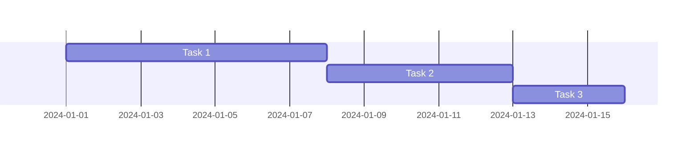
```mermaid
gantt
    dateFormat YYYY-MM-DD

    Task 1 :a, 2024-01-01, 7d
    Task 2 :b, after a, 5d
    Task 3 :c, after a b, 3d
```

---

## Excluding Days

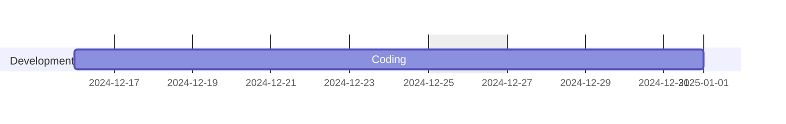
```mermaid
gantt
    dateFormat YYYY-MM-DD
    excludes weekends
    excludes 2024-12-25, 2024-12-26

    section Development
    Coding : 2024-12-16, 14d
```

Options:
- `weekends` - Exclude Sat/Sun
- Specific dates - `2024-12-25`
- Weekdays - `monday`, `tuesday`, etc.

---

## Sections

Group related tasks:

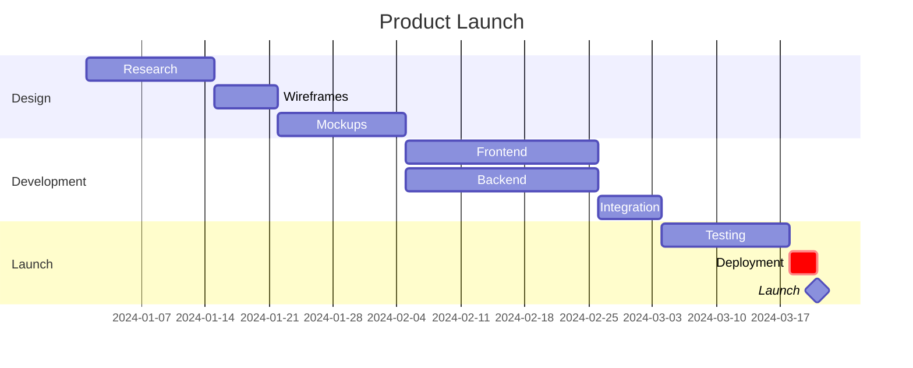
```mermaid
gantt
    title Product Launch
    dateFormat YYYY-MM-DD

    section Design
    Research         :des1, 2024-01-01, 14d
    Wireframes       :des2, after des1, 7d
    Mockups          :des3, after des2, 14d

    section Development
    Frontend         :dev1, after des3, 21d
    Backend          :dev2, after des3, 21d
    Integration      :dev3, after dev1 dev2, 7d

    section Launch
    Testing          :test, after dev3, 14d
    Deployment       :crit, deploy, after test, 3d
    Launch           :milestone, after deploy, 0d
```

---

## Example: Sprint Planning

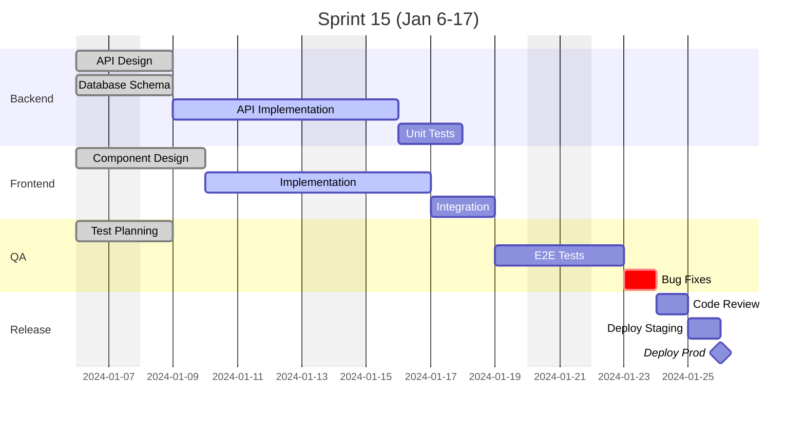
```mermaid
gantt
    title Sprint 15 (Jan 6-17)
    dateFormat YYYY-MM-DD
    excludes weekends

    section Backend
    API Design       :done, api, 2024-01-06, 2d
    Database Schema  :done, db, 2024-01-06, 2d
    API Implementation :active, impl, after api db, 5d
    Unit Tests       :test, after impl, 2d

    section Frontend
    Component Design :done, comp, 2024-01-06, 3d
    Implementation   :active, fe, after comp, 5d
    Integration      :int, after fe impl, 2d

    section QA
    Test Planning    :done, plan, 2024-01-06, 2d
    E2E Tests        :e2e, after int, 2d
    Bug Fixes        :crit, fix, after e2e, 1d

    section Release
    Code Review      :review, after fix, 1d
    Deploy Staging   :stage, after review, 1d
    Deploy Prod      :milestone, after stage, 0d
```

---

# Pie Charts

Show proportional data distribution.

## Basic Syntax

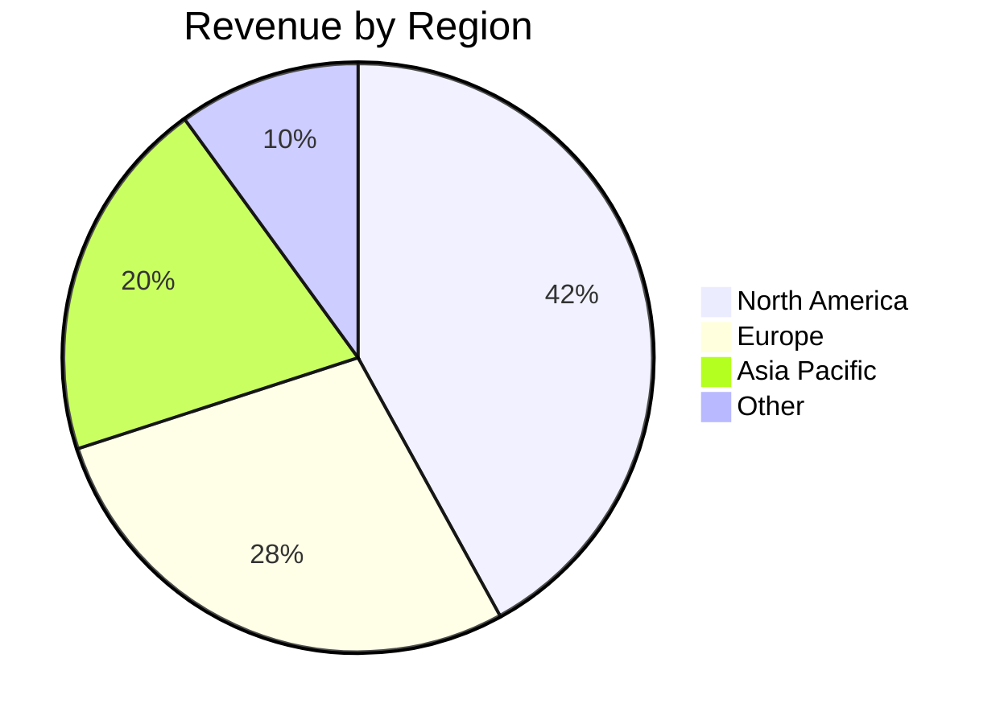
```mermaid
pie
    title Revenue by Region
    "North America" : 42
    "Europe" : 28
    "Asia Pacific" : 20
    "Other" : 10
```

## With Data Labels

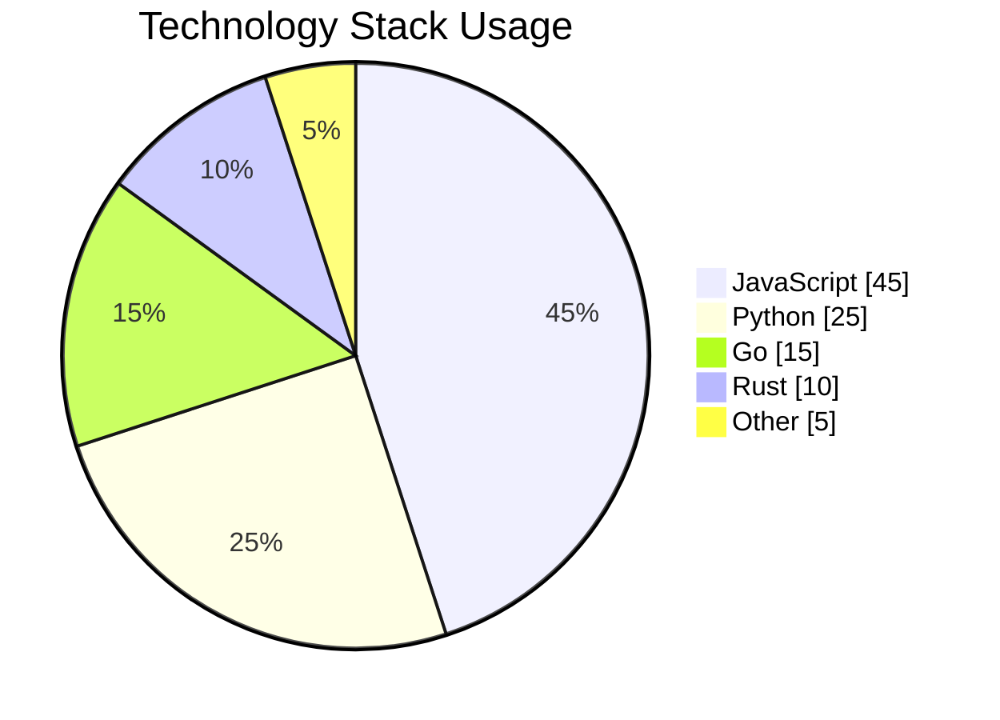
```mermaid
pie showData
    title Technology Stack Usage
    "JavaScript" : 45
    "Python" : 25
    "Go" : 15
    "Rust" : 10
    "Other" : 5
```

---

## Example: Budget Allocation

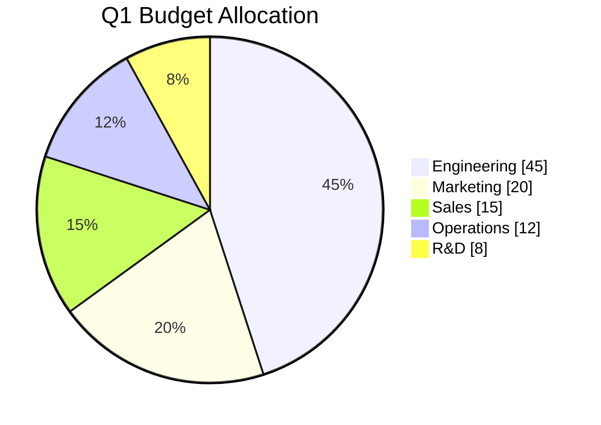
```mermaid
pie showData
    title Q1 Budget Allocation
    "Engineering" : 45
    "Marketing" : 20
    "Sales" : 15
    "Operations" : 12
    "R&D" : 8
```

---

# Timeline Diagrams

Chronological events and milestones.

## Basic Syntax

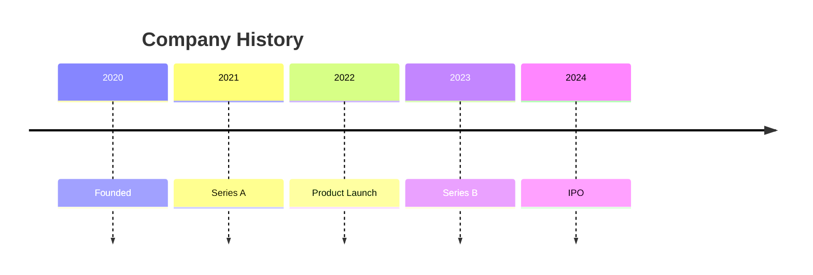
```mermaid
timeline
    title Company History
    2020 : Founded
    2021 : Series A
    2022 : Product Launch
    2023 : Series B
    2024 : IPO
```

## With Sections

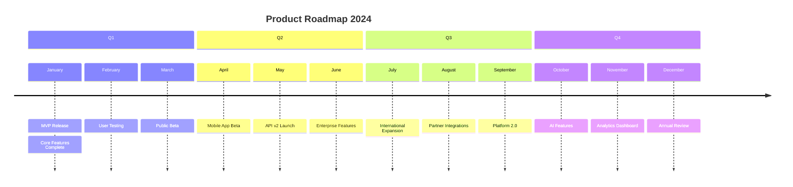
```mermaid
timeline
    title Product Roadmap 2024

    section Q1
        January : MVP Release
                : Core Features Complete
        February : User Testing
        March : Public Beta

    section Q2
        April : Mobile App Beta
        May : API v2 Launch
        June : Enterprise Features

    section Q3
        July : International Expansion
        August : Partner Integrations
        September : Platform 2.0

    section Q4
        October : AI Features
        November : Analytics Dashboard
        December : Annual Review
```

---

## Example: Project Milestones

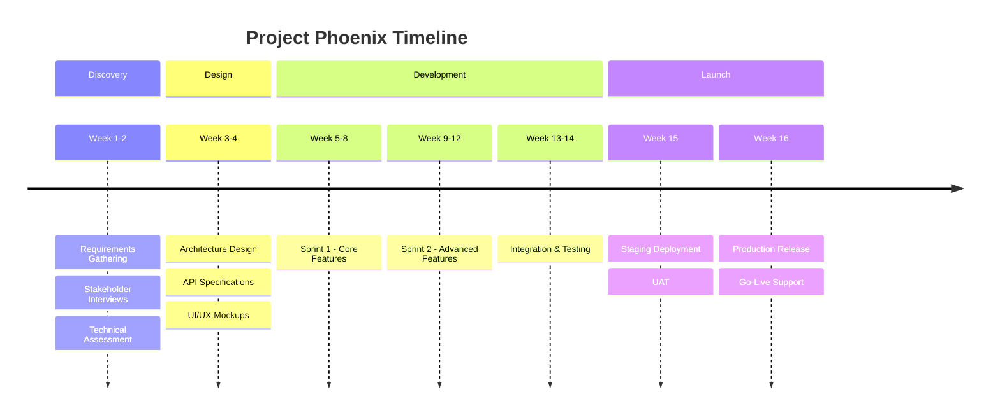
```mermaid
timeline
    title Project Phoenix Timeline

    section Discovery
        Week 1-2 : Requirements Gathering
                 : Stakeholder Interviews
                 : Technical Assessment

    section Design
        Week 3-4 : Architecture Design
                 : API Specifications
                 : UI/UX Mockups

    section Development
        Week 5-8 : Sprint 1 - Core Features
        Week 9-12 : Sprint 2 - Advanced Features
        Week 13-14 : Integration & Testing

    section Launch
        Week 15 : Staging Deployment
               : UAT
        Week 16 : Production Release
               : Go-Live Support
```

---

# Quadrant Charts

Four-quadrant analysis (effort/impact, priority matrices).

## Basic Syntax

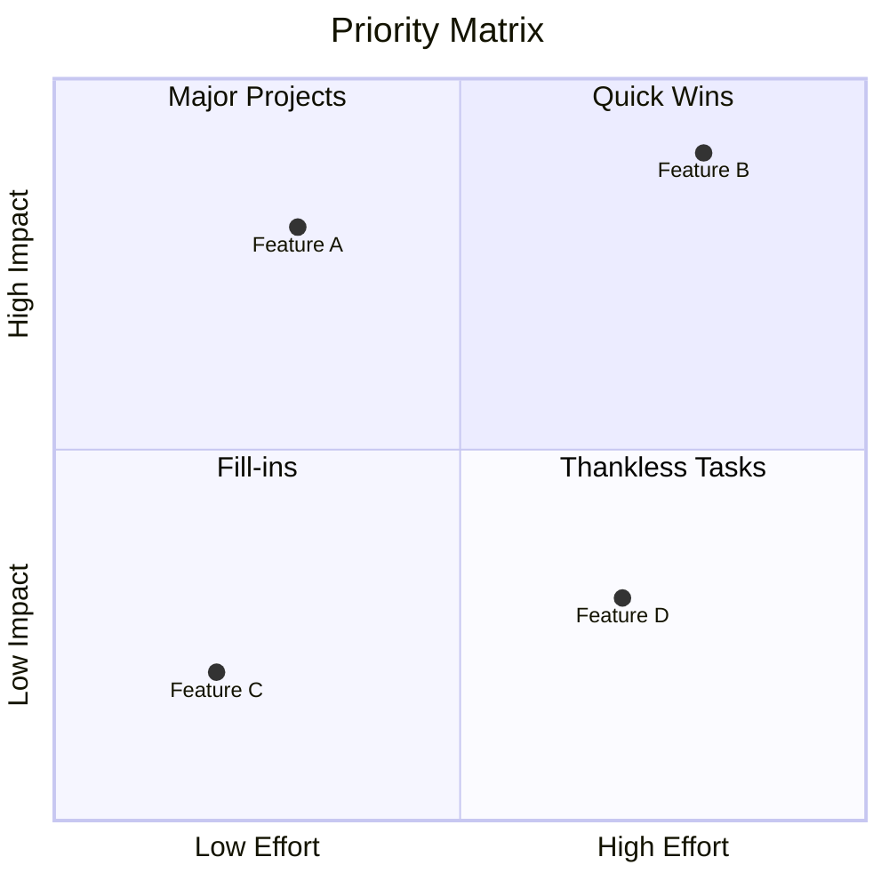
```mermaid
quadrantChart
    title Priority Matrix
    x-axis Low Effort --> High Effort
    y-axis Low Impact --> High Impact
    quadrant-1 Quick Wins
    quadrant-2 Major Projects
    quadrant-3 Fill-ins
    quadrant-4 Thankless Tasks

    Feature A: [0.3, 0.8]
    Feature B: [0.8, 0.9]
    Feature C: [0.2, 0.2]
    Feature D: [0.7, 0.3]
```

## Configuration

- Coordinates: `[x, y]` where both are 0-1
- Quadrant 1: Upper-right
- Quadrant 2: Upper-left
- Quadrant 3: Lower-left
- Quadrant 4: Lower-right

---

## Example: Technology Evaluation

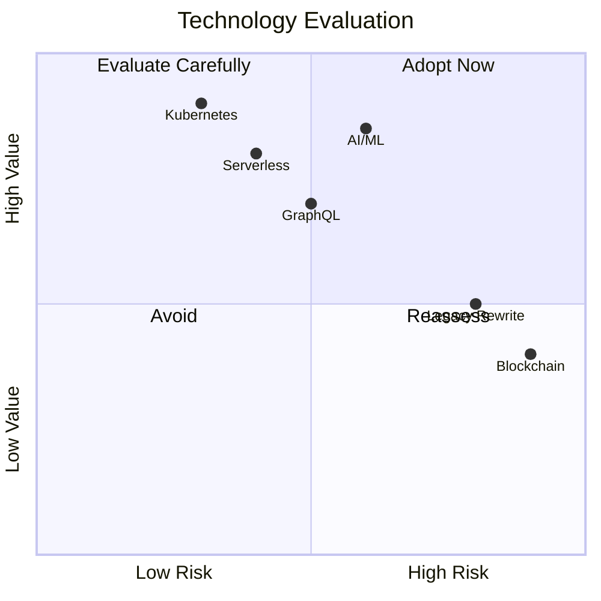
```mermaid
quadrantChart
    title Technology Evaluation
    x-axis Low Risk --> High Risk
    y-axis Low Value --> High Value
    quadrant-1 Adopt Now
    quadrant-2 Evaluate Carefully
    quadrant-3 Avoid
    quadrant-4 Reassess

    Kubernetes: [0.3, 0.9]
    Serverless: [0.4, 0.8]
    GraphQL: [0.5, 0.7]
    Blockchain: [0.9, 0.4]
    AI/ML: [0.6, 0.85]
    Legacy Rewrite: [0.8, 0.5]
```

---

# XY Charts

Line and bar charts for data trends.

## Basic Syntax

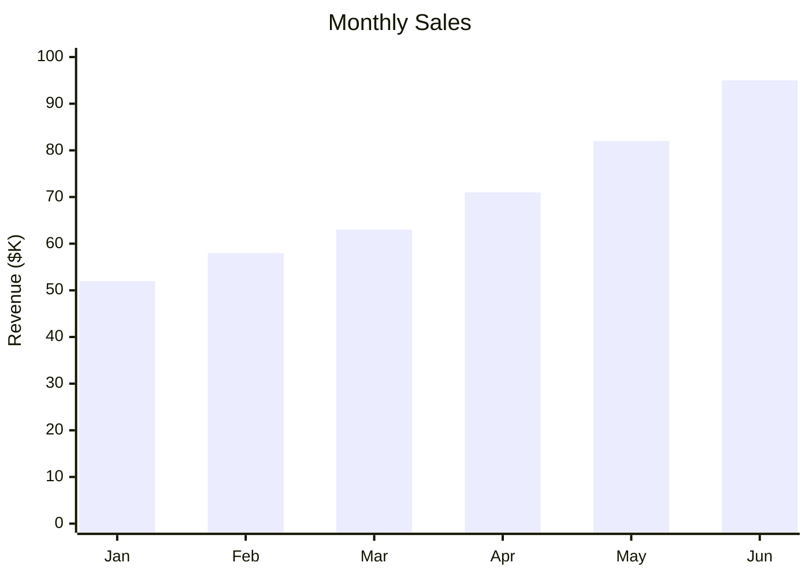
```mermaid
xychart-beta
    title "Monthly Sales"
    x-axis [Jan, Feb, Mar, Apr, May, Jun]
    y-axis "Revenue ($K)" 0 --> 100

    bar [52, 58, 63, 71, 82, 95]
```

## Line Chart

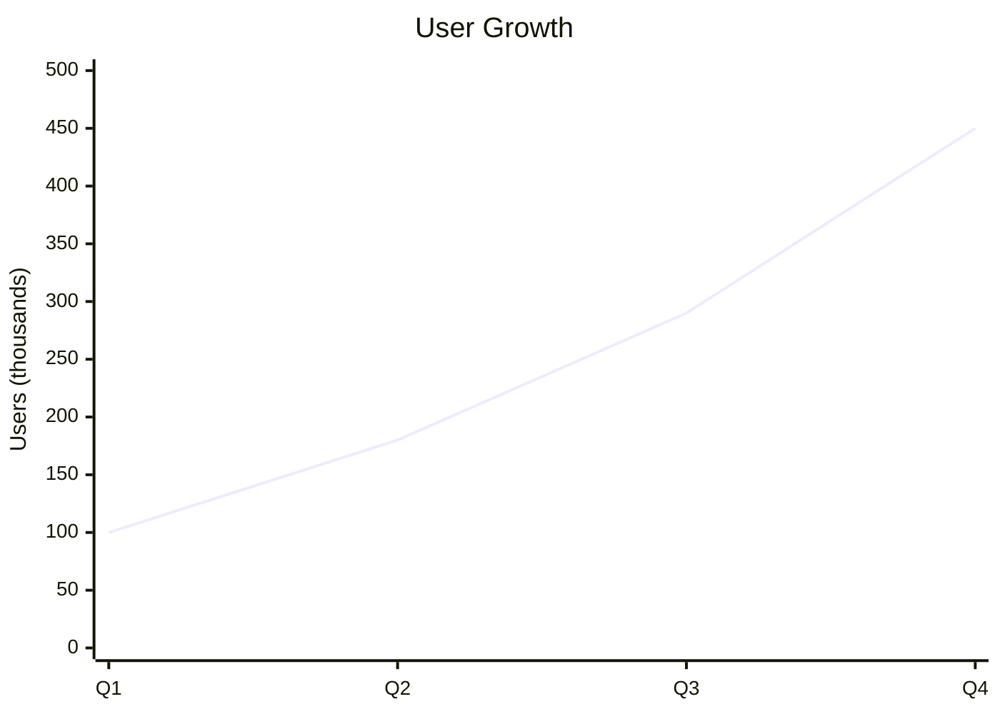
```mermaid
xychart-beta
    title "User Growth"
    x-axis [Q1, Q2, Q3, Q4]
    y-axis "Users (thousands)" 0 --> 500

    line [100, 180, 290, 450]
```

## Combined

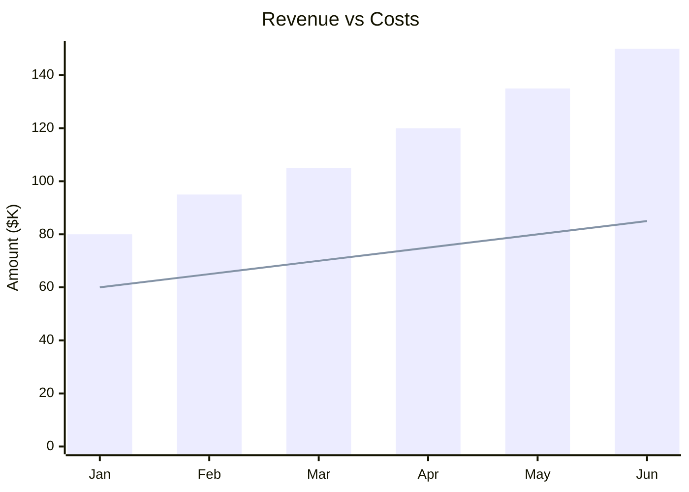
```mermaid
xychart-beta
    title "Revenue vs Costs"
    x-axis [Jan, Feb, Mar, Apr, May, Jun]
    y-axis "Amount ($K)" 0 --> 150

    bar "Revenue" [80, 95, 105, 120, 135, 150]
    line "Costs" [60, 65, 70, 75, 80, 85]
```

---

# Sankey Diagrams

Flow and allocation visualization.

## Basic Syntax

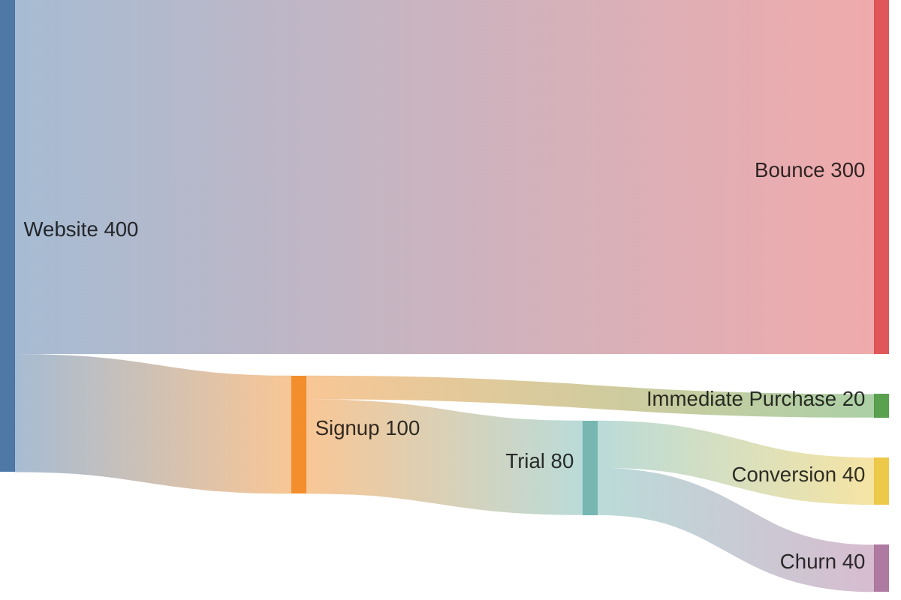
```mermaid
sankey-beta

Website, Signup, 100
Website, Bounce, 300
Signup, Trial, 80
Signup, Immediate Purchase, 20
Trial, Conversion, 40
Trial, Churn, 40
```

## Example: Budget Flow

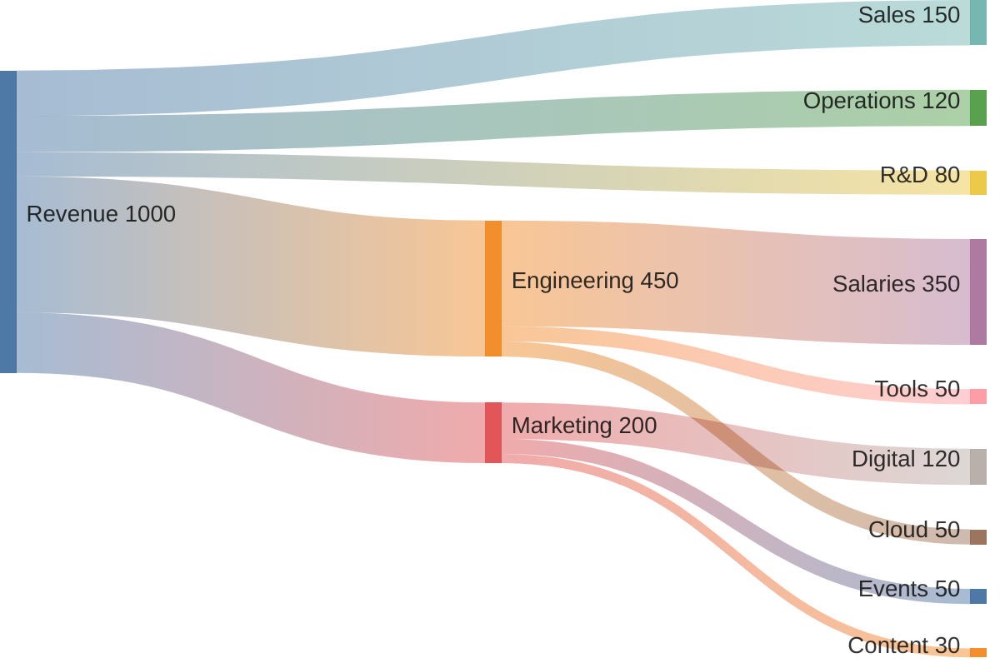
```mermaid
sankey-beta

Revenue, Engineering, 450
Revenue, Marketing, 200
Revenue, Sales, 150
Revenue, Operations, 120
Revenue, R&D, 80

Engineering, Salaries, 350
Engineering, Tools, 50
Engineering, Cloud, 50

Marketing, Digital, 120
Marketing, Events, 50
Marketing, Content, 30
```

---

## Example: User Journey Flow

```mermaid
sankey-beta

Homepage, Products, 450
Homepage, About, 100
Homepage, Bounce, 450

Products, Cart, 200
Products, Exit, 250

Cart, Checkout, 150
Cart, Abandon, 50

Checkout, Purchase, 120
Checkout, Fail, 30
```

---

# Treemap Diagrams

Hierarchical data with area representation.

## Basic Syntax

```mermaid
treemap-beta

"Category A"
    "Item A1": 10
    "Item A2": 20

"Category B"
    "Item B1": 15
    "Item B2": 25
```

## Example: Codebase Size

```mermaid
treemap-beta

"src"
    "components": 45
    "pages": 30
    "utils": 15
    "hooks": 10

"tests"
    "unit": 20
    "integration": 15
    "e2e": 10

"docs"
    "api": 8
    "guides": 12
```

---

# Mindmaps

Hierarchical brainstorming and concept mapping.

## Basic Syntax

```mermaid
mindmap
    root((Project))
        Frontend
            React
            TypeScript
            Tailwind
        Backend
            Node.js
            PostgreSQL
            Redis
        Infrastructure
            AWS
            Docker
            Kubernetes
```

## Node Shapes

```mermaid
mindmap
    root((Circle))
        Square[Square]
        Rounded(Rounded)
        Bang))Bang((
        Cloud)Cloud(
        Hexagon{{Hexagon}}
```

---

## Example: Architecture Decision

```mermaid
mindmap
    root((System Design))
        Frontend
            Framework
                React
                Vue
                Svelte
            State
                Redux
                Zustand
                Context
            Styling
                Tailwind
                CSS Modules
        Backend
            Language
                Node.js
                Go
                Python
            Database
                PostgreSQL
                MongoDB
                Redis
            API
                REST
                GraphQL
                gRPC
        Infrastructure
            Cloud
                AWS
                GCP
                Azure
            Containers
                Docker
                Kubernetes
            CI/CD
                GitHub Actions
                GitLab CI
```

---

# Git Graphs

Branch and merge visualization.

## Basic Syntax

```mermaid
gitGraph
    commit id: "Initial commit"
    branch develop
    checkout develop
    commit id: "Add feature A"
    commit id: "Add feature B"
    checkout main
    merge develop id: "Merge develop"
    commit id: "Hotfix"
```

## Advanced Features

```mermaid
gitGraph
    commit id: "v1.0.0" tag: "v1.0.0"
    branch feature/auth
    checkout feature/auth
    commit id: "Add login"
    commit id: "Add logout"
    checkout main
    branch feature/api
    checkout feature/api
    commit id: "Add endpoints"
    checkout main
    merge feature/auth id: "Merge auth"
    merge feature/api id: "Merge api"
    commit id: "v1.1.0" tag: "v1.1.0"
```

## Types

- `commit` - Normal commit
- `commit type: HIGHLIGHT` - Highlighted
- `commit type: REVERSE` - Reversed

---

## Example: Git Flow

```mermaid
gitGraph
    commit id: "Init"

    branch develop
    checkout develop
    commit id: "Setup"

    branch feature/login
    checkout feature/login
    commit id: "Login UI"
    commit id: "Login API"
    checkout develop
    merge feature/login

    branch feature/dashboard
    checkout feature/dashboard
    commit id: "Dashboard"
    checkout develop
    merge feature/dashboard

    branch release/1.0
    checkout release/1.0
    commit id: "Bump version"
    checkout main
    merge release/1.0 tag: "v1.0.0"
    checkout develop
    merge release/1.0

    checkout main
    branch hotfix/1.0.1
    commit id: "Fix bug"
    checkout main
    merge hotfix/1.0.1 tag: "v1.0.1"
    checkout develop
    merge hotfix/1.0.1
```
