# Flowchart Diagrams

Flowcharts visualize processes, algorithms, and decision flows using nodes and edges.

---

## Basic Syntax

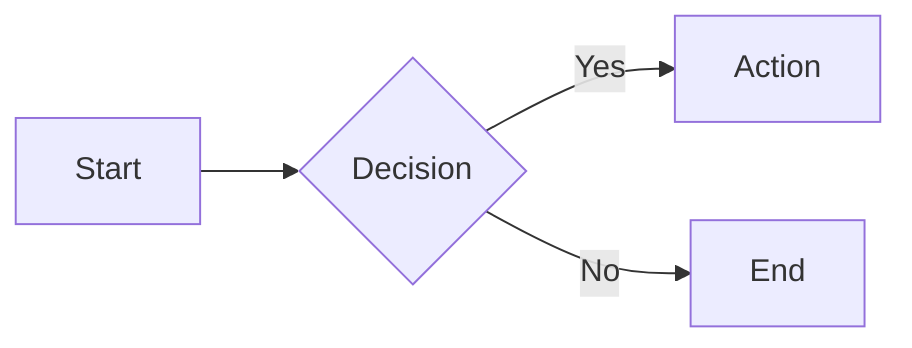

---

## Direction

| Declaration | Direction |
|-------------|-----------|
| `TB` / `TD` | Top to Bottom |
| `BT` | Bottom to Top |
| `LR` | Left to Right |
| `RL` | Right to Left |

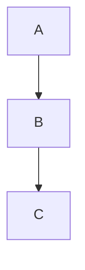

---

## Node Shapes

### Standard Shapes

```
A[Rectangle]         Default box
B(Rounded)           Rounded corners
C([Stadium])         Pill shape
D[[Subroutine]]      Double vertical lines
E[(Database)]        Cylinder
F((Circle))          Circle
G{Diamond}           Decision/rhombus
H{{Hexagon}}         Hexagon
I[/Parallelogram/]   Slanted right
J[\Parallelogram\]   Slanted left
K[/Trapezoid\]       Trapezoid
L[\Trapezoid/]       Inverted trapezoid
M(((Double Circle))) Double circle
```

### Extended Shapes (v11.3+)

New syntax using `@{ shape: name }`:

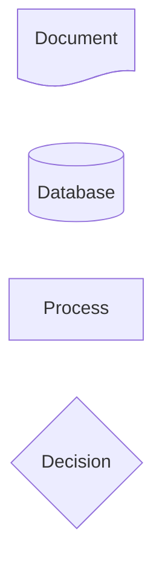

**Available extended shapes:**

| Shape | Description |
|-------|-------------|
| `rect` | Rectangle |
| `rounded` | Rounded rectangle |
| `stadium` | Stadium/pill |
| `subroutine` | Subroutine box |
| `cyl` | Cylinder (database) |
| `circle` | Circle |
| `dbl-circ` | Double circle |
| `diamond` | Diamond/rhombus |
| `hex` | Hexagon |
| `lean-r` | Lean right (parallelogram) |
| `lean-l` | Lean left |
| `trap-b` | Trapezoid bottom |
| `trap-t` | Trapezoid top |
| `doc` | Document |
| `notch-rect` | Notched rectangle |
| `brace` | Curly brace left |
| `brace-r` | Curly brace right |
| `braces` | Double braces |
| `comment` | Comment |
| `bolt` | Lightning bolt |
| `lin-cyl` | Lined cylinder |
| `bow-rect` | Bow tie rectangle |
| `div-rect` | Divided rectangle |
| `odd` | Odd shape |
| `win-pane` | Window pane |
| `f-circ` | Filled circle |
| `lin-doc` | Lined document |
| `tri` | Triangle |
| `fork` | Fork |
| `hourglass` | Hourglass |
| `flag` | Flag |
| `tag-doc` | Tagged document |
| `tag-rect` | Tagged rectangle |
| `half-rounded-rect` | Half rounded rectangle |
| `curv-trap` | Curved trapezoid |

---

## Edge Types

### Basic Edges

```
A --> B       Solid arrow
A --- B       Solid line (no arrow)
A -.-> B      Dotted arrow
A -.- B       Dotted line
A ==> B       Thick arrow
A === B       Thick line
```

### Arrow Ends

```
A --o B       Circle end
A --x B       Cross end
A o--o B      Circle both ends
A x--x B      Cross both ends
A <--> B      Arrows both ends
```

### Edge Labels

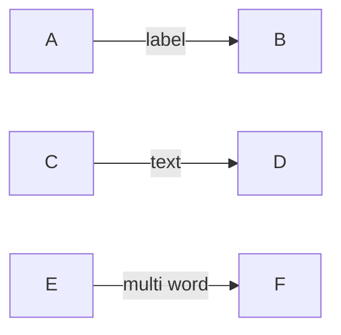

### Edge Length

Control edge length with extra dashes:

```
A --> B        Normal
A ---> B       Longer
A ----> B      Even longer
```

### Edge IDs and Animation (v11+)

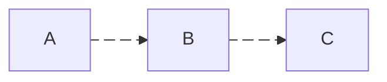

---

## Subgraphs

Group related nodes:

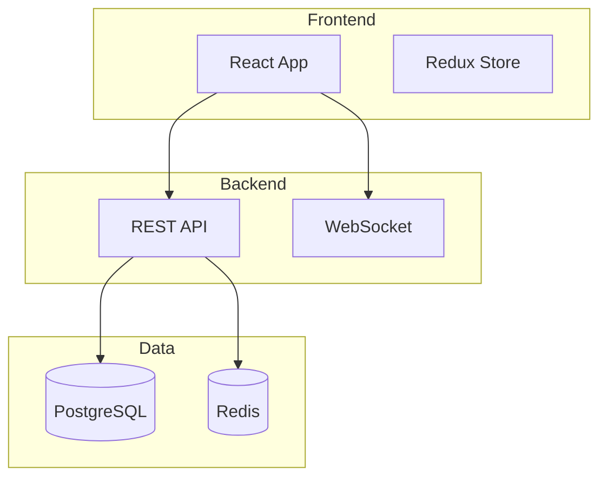

### Nested Subgraphs

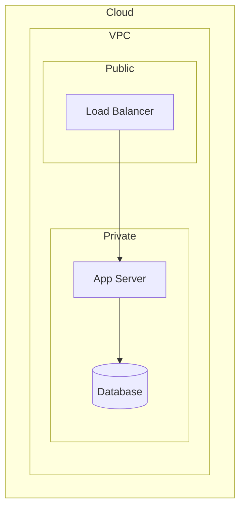

### Subgraph Direction

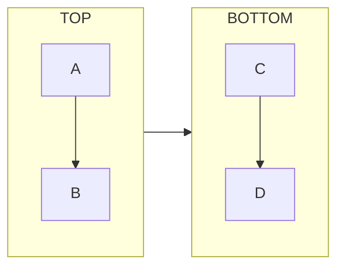

---

## Multi-Target Edges

Connect multiple nodes:

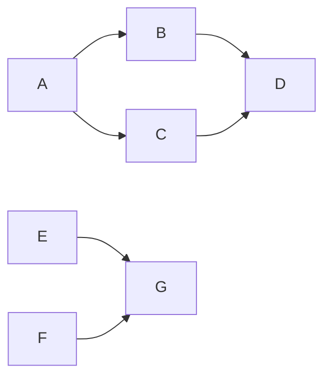

---

## Markdown in Labels

Use backticks for markdown:

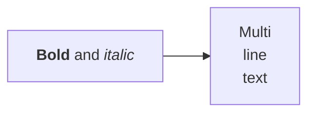

---

## Icons

FontAwesome icons (when enabled):

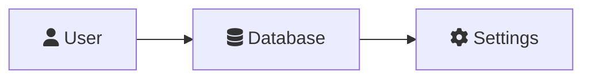

---

## Click Events

### Links

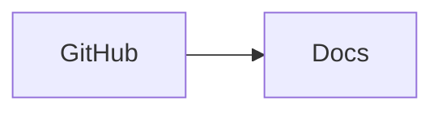

### Callbacks

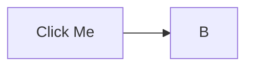

---

## Styling

### Inline Styles

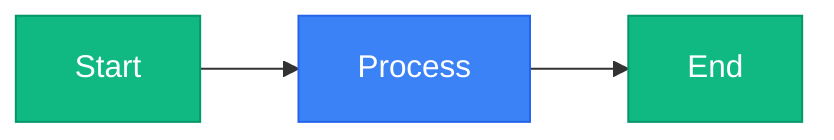

### Individual Node Style

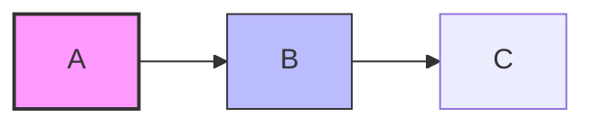

### Link Styles

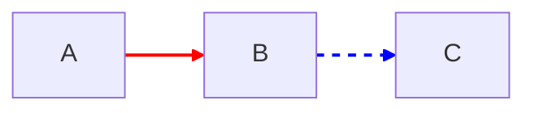

### Default Styles

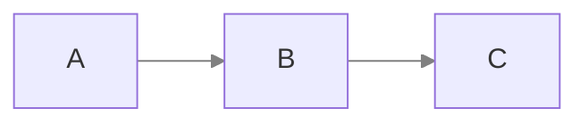

---

## Layout Engine

Use ELK for complex diagrams (v9.4+):

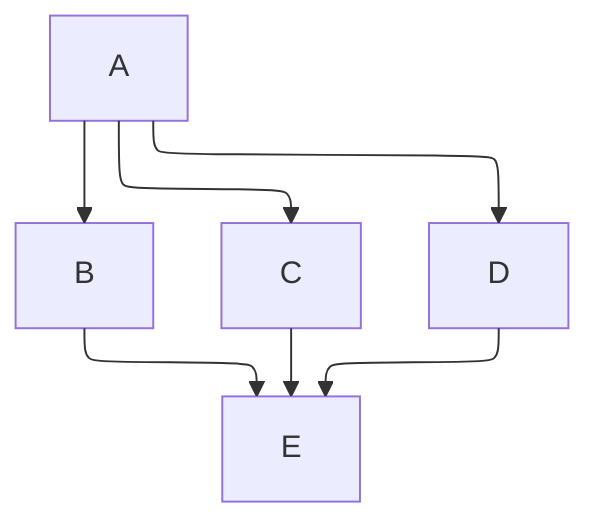

---

## Examples

### Microservices Architecture

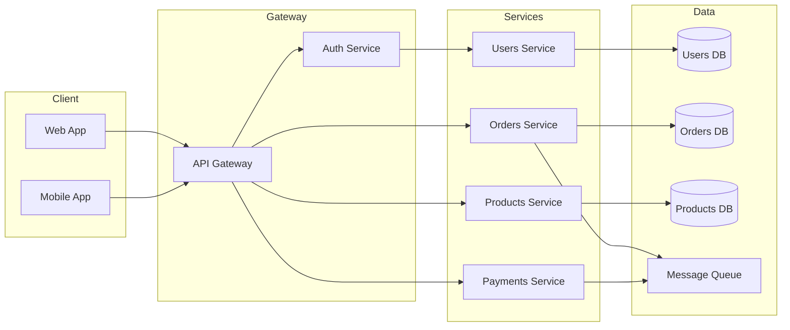

### CI/CD Pipeline

```mermaid
flowchart LR
    subgraph Source
        Git[Git Push]
    end

    subgraph Build
        Lint[Lint]
        Test[Test]
        Build[Build]
    end

    subgraph Deploy
        Staging[Staging]
        Prod[Production]
    end

    Git --> Lint --> Test --> Build
    Build --> Staging
    Staging -->|approved| Prod

    style Prod fill:#10b981
```

### Decision Tree

```mermaid
flowchart TD
    Start[User Request] --> Auth{Authenticated?}
    Auth -->|Yes| Perm{Has Permission?}
    Auth -->|No| Login[Redirect to Login]
    Perm -->|Yes| Process[Process Request]
    Perm -->|No| Denied[403 Forbidden]
    Process --> Success[200 OK]

    style Success fill:#10b981
    style Denied fill:#ef4444
    style Login fill:#f59e0b
```

### Data Flow

```mermaid
flowchart LR
    Input[(Raw Data)] --> Transform[ETL Process]
    Transform --> Validate{Valid?}
    Validate -->|Yes| Store[(Data Warehouse)]
    Validate -->|No| Error[Error Queue]
    Store --> Analytics[Analytics Engine]
    Analytics --> Dashboard[Dashboard]
    Analytics --> Reports[Reports]
```
