# Sequence Diagrams

Sequence diagrams show interactions between participants over time. Ideal for API flows, protocols, and service communication.

---

## Basic Syntax

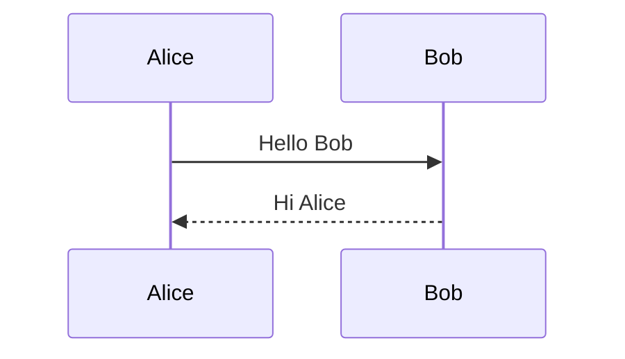
```mermaid
sequenceDiagram
    Alice->>Bob: Hello Bob
    Bob-->>Alice: Hi Alice
```

---

## Participants

### Implicit Declaration

Participants appear in order of first message:

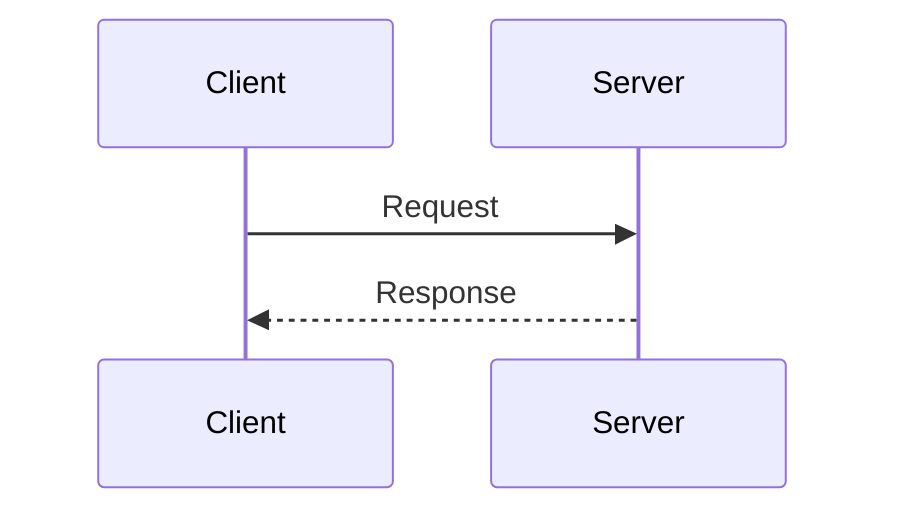
```mermaid
sequenceDiagram
    Client->>Server: Request
    Server-->>Client: Response
```

### Explicit Declaration

Control order and add aliases:

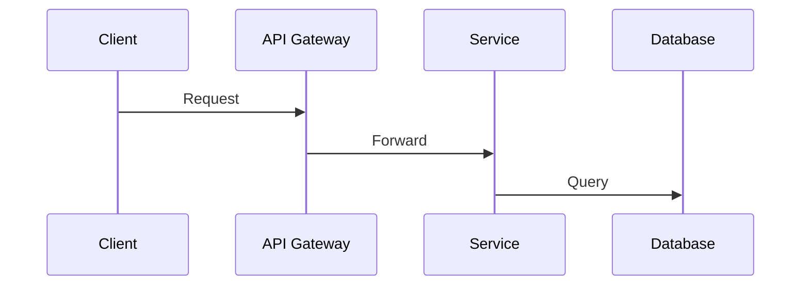
```mermaid
sequenceDiagram
    participant C as Client
    participant A as API Gateway
    participant S as Service
    participant D as Database

    C->>A: Request
    A->>S: Forward
    S->>D: Query
```

### Actors (Stick Figures)

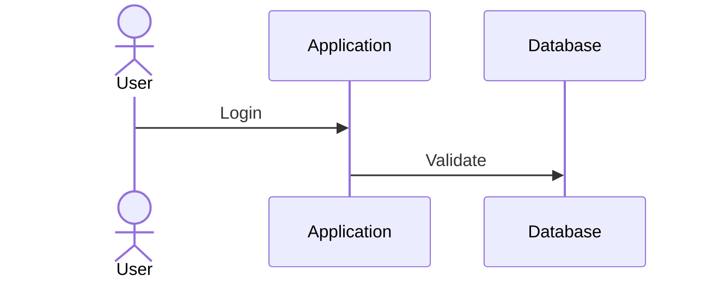
```mermaid
sequenceDiagram
    actor User
    participant App as Application
    participant DB as Database

    User->>App: Login
    App->>DB: Validate
```

### Create and Destroy

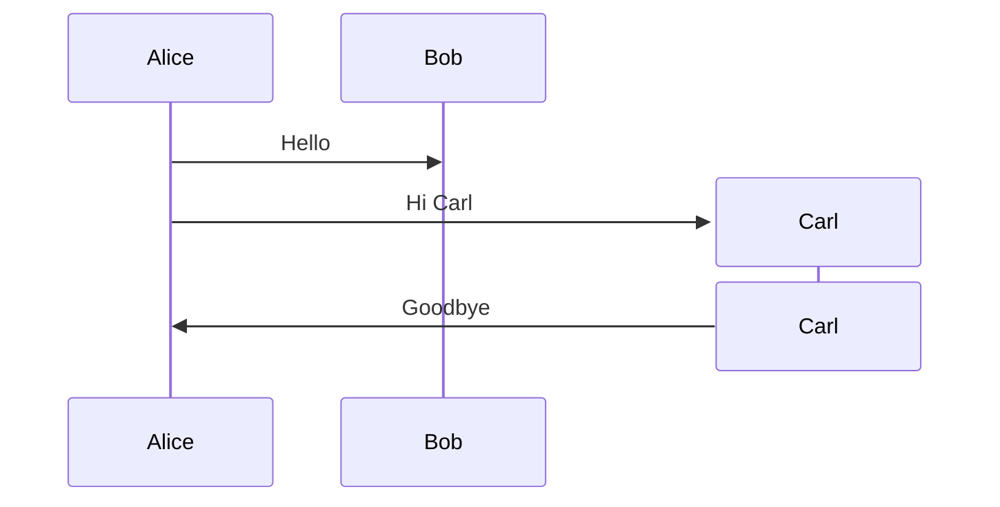
```mermaid
sequenceDiagram
    Alice->>Bob: Hello
    create participant Carl
    Alice->>Carl: Hi Carl
    destroy Carl
    Carl->>Alice: Goodbye
```

---

## Message Types

| Syntax | Description |
|--------|-------------|
| `->` | Solid line without arrow |
| `-->` | Dotted line without arrow |
| `->>` | Solid line with arrow (sync) |
| `-->>` | Dotted line with arrow (async/response) |
| `-x` | Solid line with cross (failed) |
| `--x` | Dotted line with cross |
| `-)` | Solid line with open arrow (async) |
| `--)` | Dotted line with open arrow |

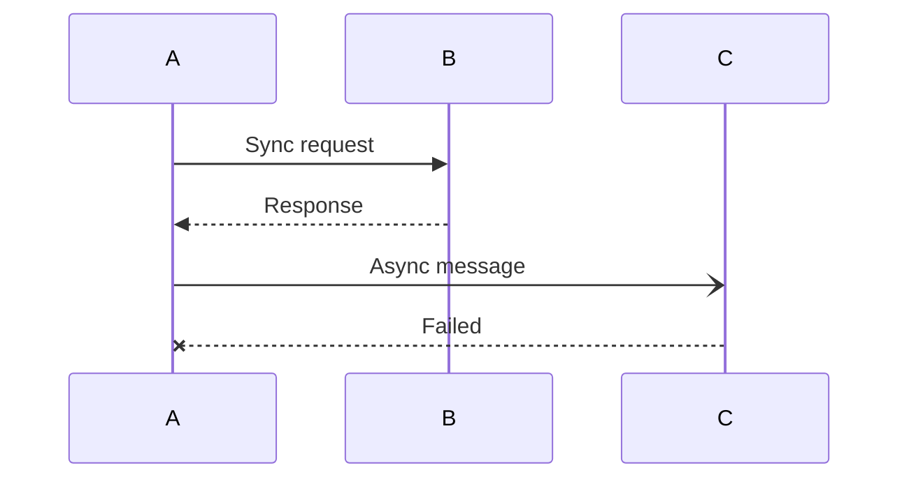
```mermaid
sequenceDiagram
    A->>B: Sync request
    B-->>A: Response
    A-)C: Async message
    C--x A: Failed
```

---

## Activation (Lifeline)

Show when participant is active:

### Manual Activation

```mermaid
sequenceDiagram
    Client->>+Server: Request
    Server->>+Database: Query
    Database-->>-Server: Results
    Server-->>-Client: Response
```

### Explicit Activate/Deactivate

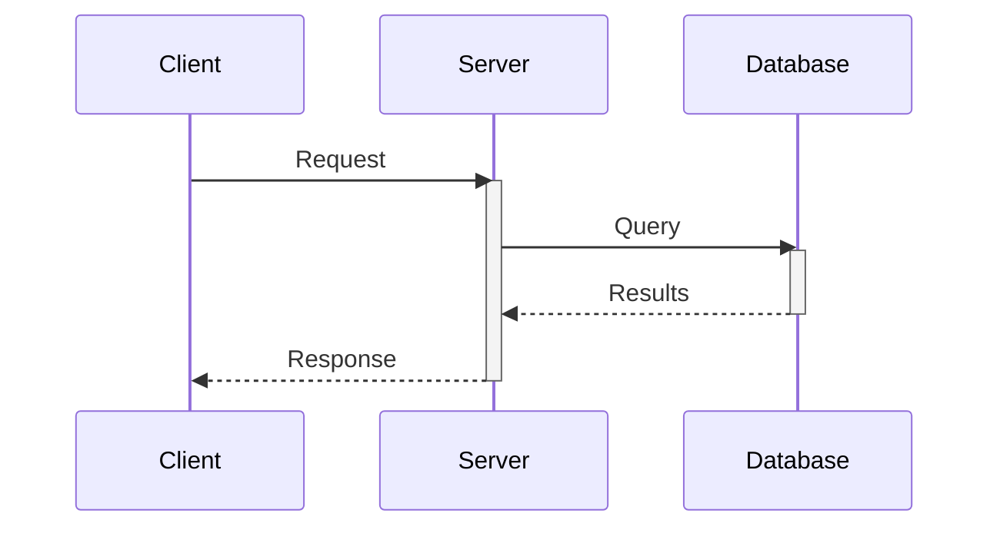
```mermaid
sequenceDiagram
    Client->>Server: Request
    activate Server
    Server->>Database: Query
    activate Database
    Database-->>Server: Results
    deactivate Database
    Server-->>Client: Response
    deactivate Server
```

### Nested Activation

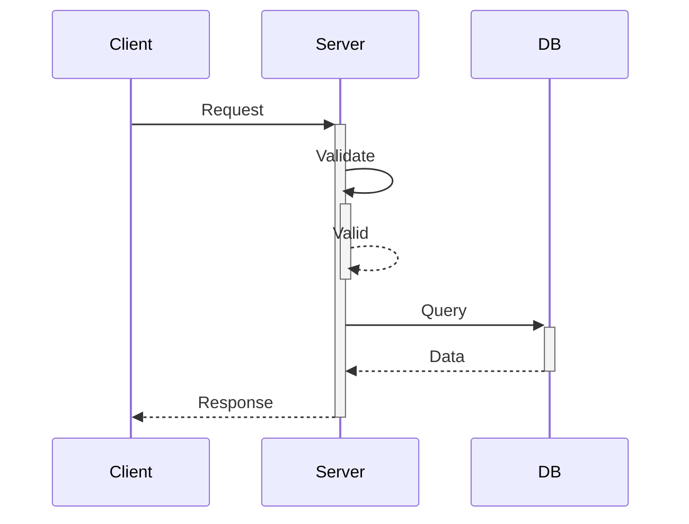
```mermaid
sequenceDiagram
    Client->>+Server: Request
    Server->>+Server: Validate
    Server-->>-Server: Valid
    Server->>+DB: Query
    DB-->>-Server: Data
    Server-->>-Client: Response
```

---

## Control Flow

### Alt (If/Else)

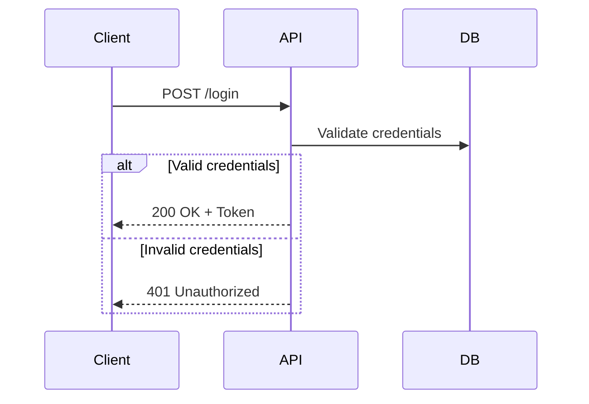
```mermaid
sequenceDiagram
    Client->>API: POST /login
    API->>DB: Validate credentials

    alt Valid credentials
        API-->>Client: 200 OK + Token
    else Invalid credentials
        API-->>Client: 401 Unauthorized
    end
```

### Opt (Optional)

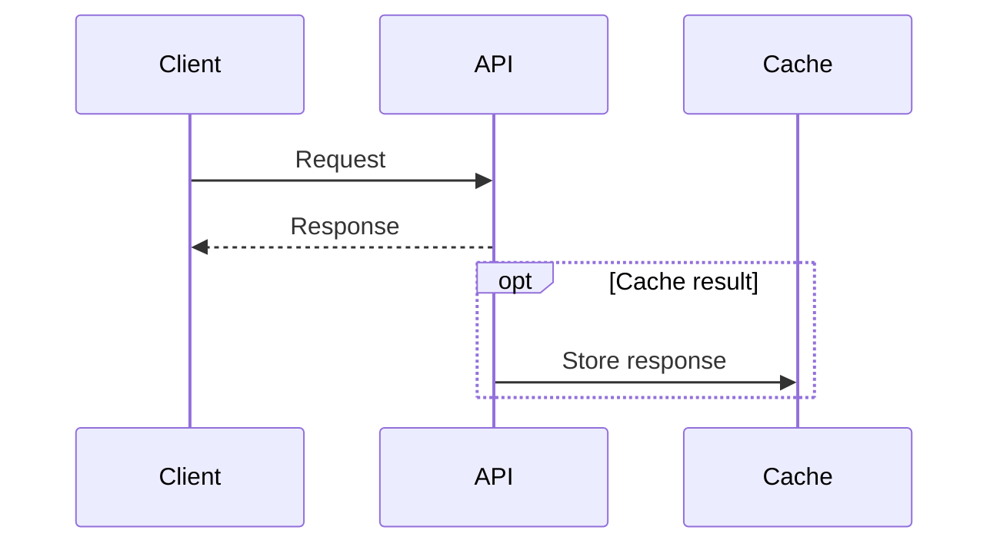
```mermaid
sequenceDiagram
    Client->>API: Request
    API-->>Client: Response

    opt Cache result
        API->>Cache: Store response
    end
```

### Loop

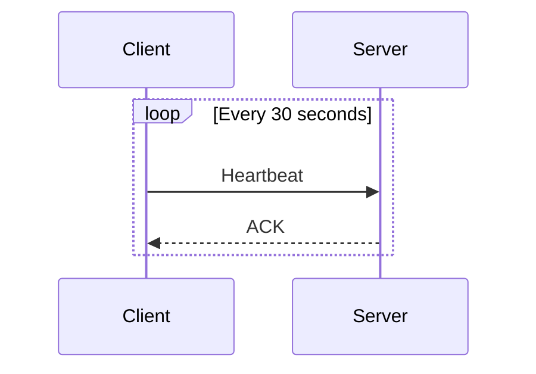
```mermaid
sequenceDiagram
    loop Every 30 seconds
        Client->>Server: Heartbeat
        Server-->>Client: ACK
    end
```

### Par (Parallel)

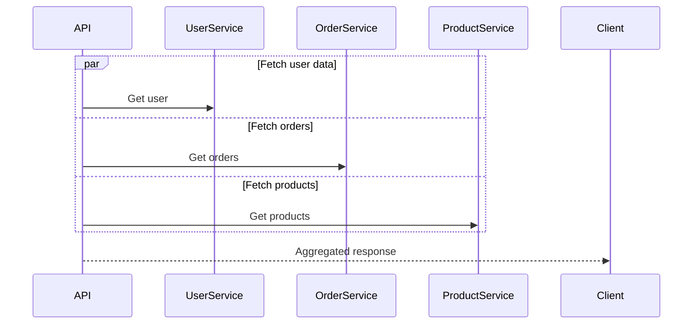
```mermaid
sequenceDiagram
    par Fetch user data
        API->>UserService: Get user
    and Fetch orders
        API->>OrderService: Get orders
    and Fetch products
        API->>ProductService: Get products
    end
    API-->>Client: Aggregated response
```

### Critical Section

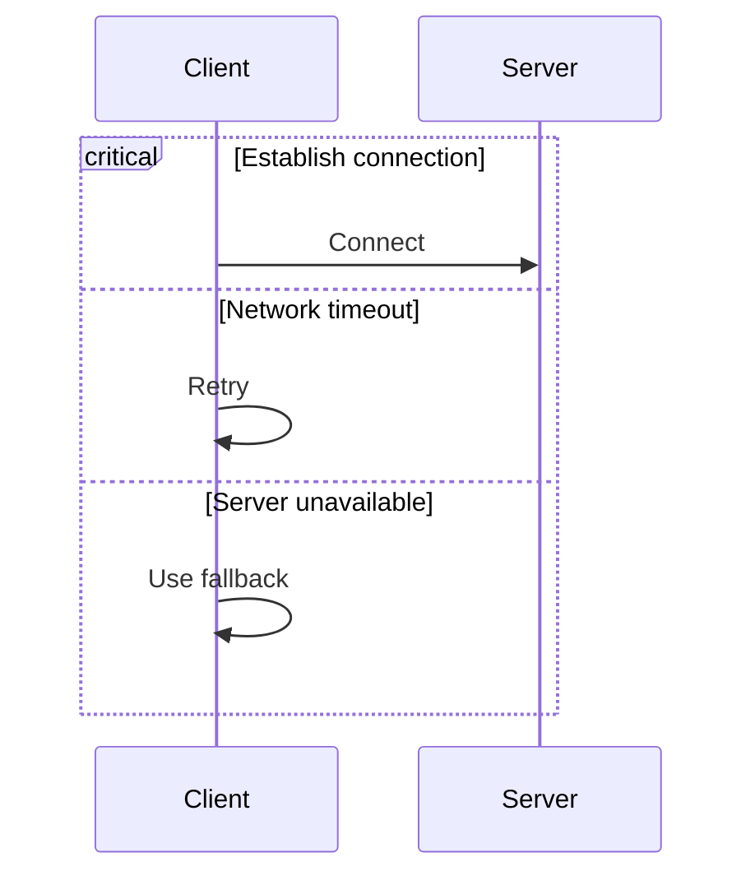
```mermaid
sequenceDiagram
    critical Establish connection
        Client->>Server: Connect
    option Network timeout
        Client->>Client: Retry
    option Server unavailable
        Client->>Client: Use fallback
    end
```

### Break (Early Exit)

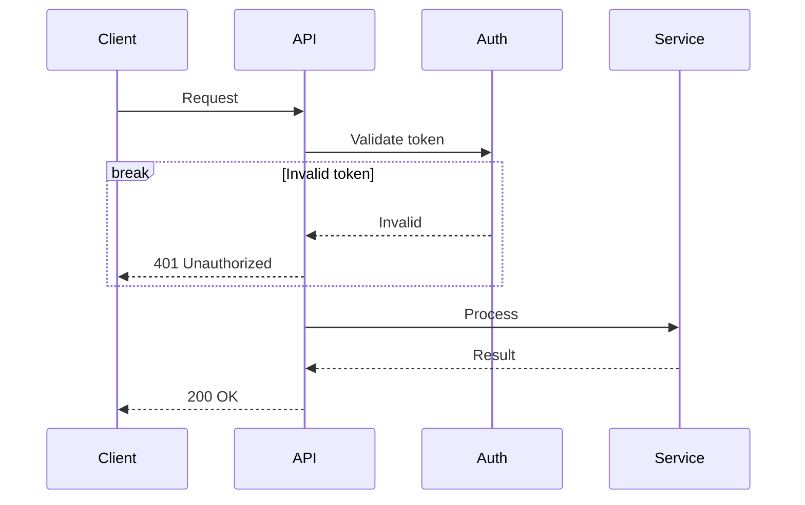
```mermaid
sequenceDiagram
    Client->>API: Request
    API->>Auth: Validate token

    break Invalid token
        Auth-->>API: Invalid
        API-->>Client: 401 Unauthorized
    end

    API->>Service: Process
    Service-->>API: Result
    API-->>Client: 200 OK
```

---

## Notes

### Position

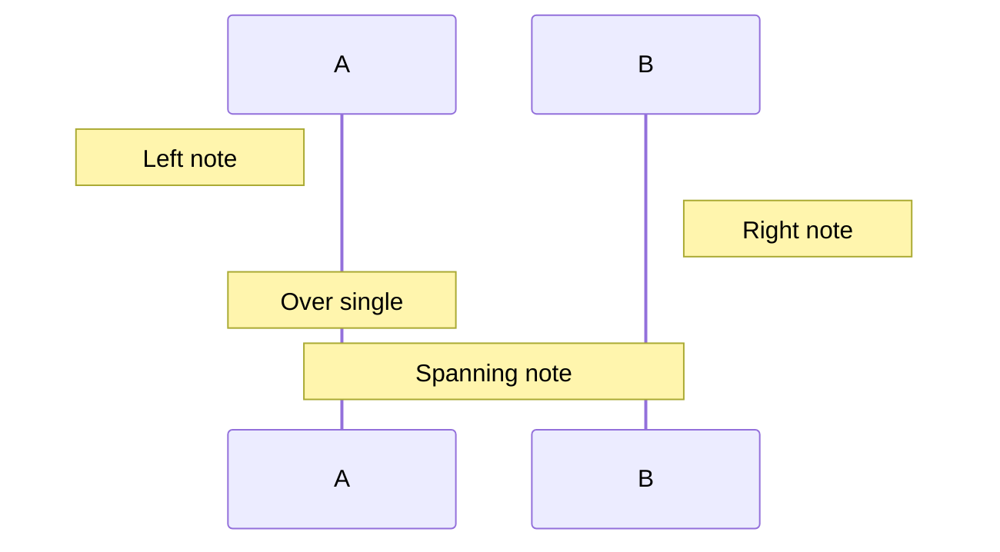
```mermaid
sequenceDiagram
    participant A
    participant B

    Note left of A: Left note
    Note right of B: Right note
    Note over A: Over single
    Note over A,B: Spanning note
```

### With Messages

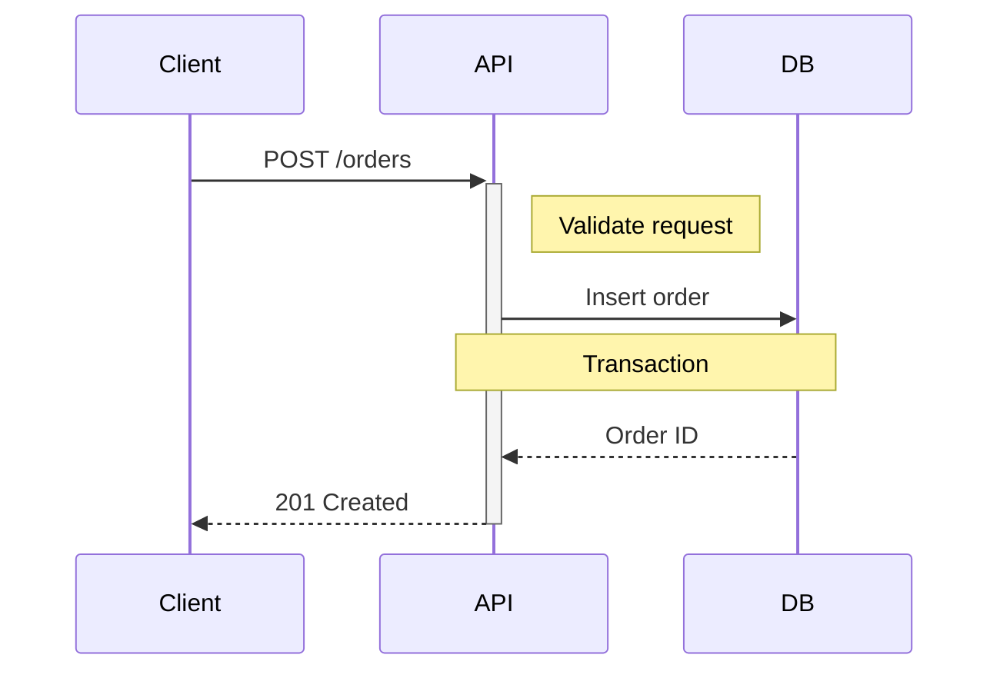
```mermaid
sequenceDiagram
    Client->>+API: POST /orders
    Note right of API: Validate request
    API->>DB: Insert order
    Note over API,DB: Transaction
    DB-->>API: Order ID
    API-->>-Client: 201 Created
```

---

## Autonumbering

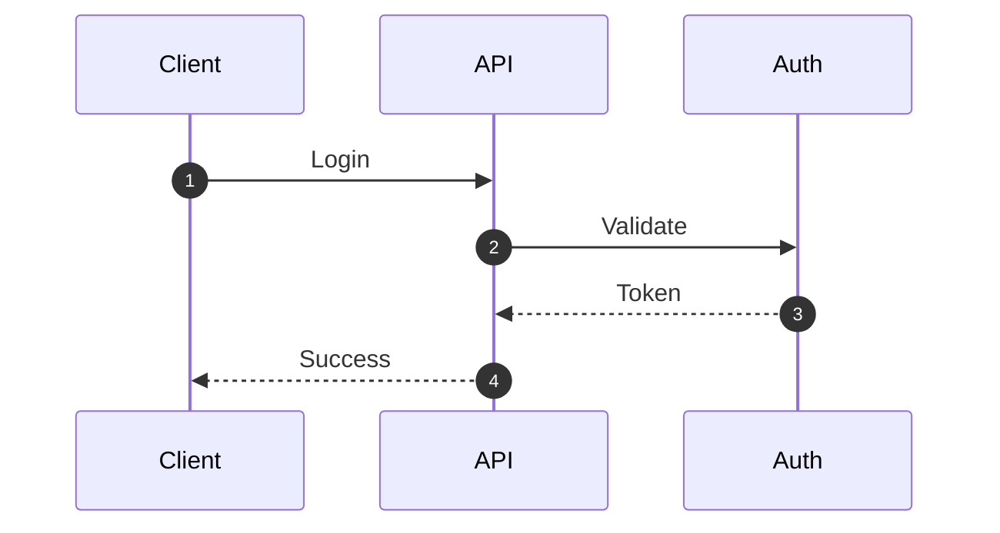
```mermaid
sequenceDiagram
    autonumber
    Client->>API: Login
    API->>Auth: Validate
    Auth-->>API: Token
    API-->>Client: Success
```

---

## Background Highlighting

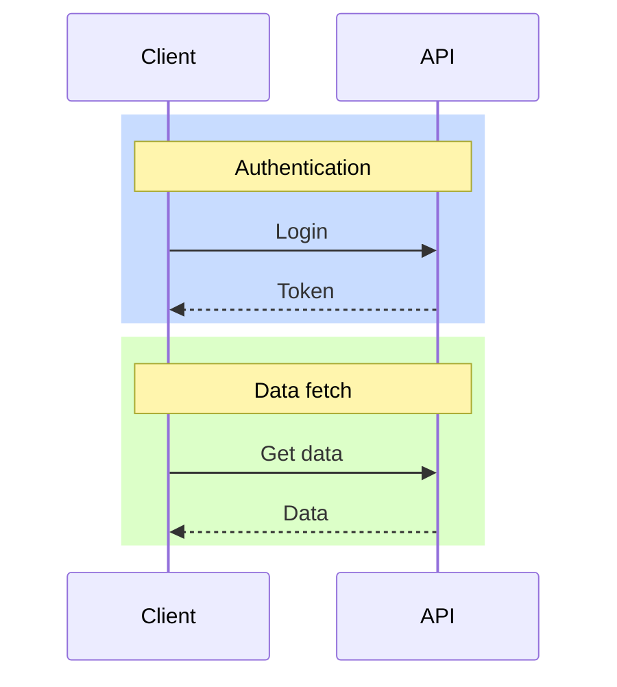
```mermaid
sequenceDiagram
    rect rgb(200, 220, 255)
        Note over Client,API: Authentication
        Client->>API: Login
        API-->>Client: Token
    end

    rect rgb(220, 255, 200)
        Note over Client,API: Data fetch
        Client->>API: Get data
        API-->>Client: Data
    end
```

---

## Participant Boxes

Group participants visually:

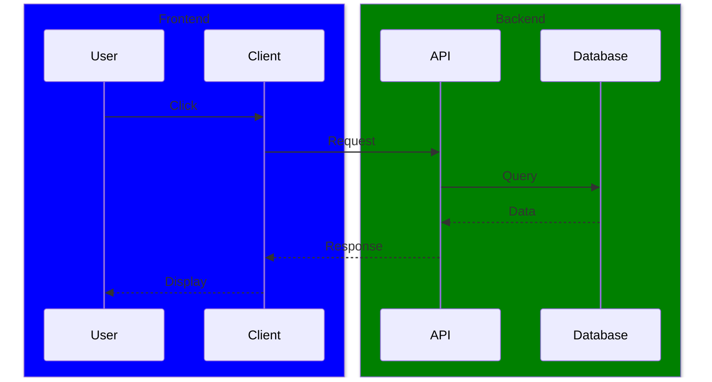
```mermaid
sequenceDiagram
    box Blue Frontend
        participant U as User
        participant C as Client
    end
    box Green Backend
        participant A as API
        participant D as Database
    end

    U->>C: Click
    C->>A: Request
    A->>D: Query
    D-->>A: Data
    A-->>C: Response
    C-->>U: Display
```

---

## Examples

### OAuth 2.0 Authorization Code Flow

```mermaid
sequenceDiagram
    autonumber
    actor User
    participant Client as Client App
    participant Auth as Auth Server
    participant API as Resource API

    User->>Client: Click Login
    Client->>Auth: Authorization request
    Auth->>User: Login page
    User->>Auth: Credentials
    Auth-->>Client: Authorization code

    Client->>+Auth: Exchange code for token
    Note right of Auth: Validate code
    Auth-->>-Client: Access + Refresh tokens

    Client->>+API: Request + Access token
    API->>API: Validate token
    API-->>-Client: Protected resource
    Client-->>User: Display data
```

### WebSocket Connection

```mermaid
sequenceDiagram
    participant C as Client
    participant S as Server

    C->>S: HTTP Upgrade request
    S-->>C: 101 Switching Protocols

    rect rgb(230, 245, 255)
        Note over C,S: WebSocket connection established
        loop Bidirectional messaging
            C-)S: Send message
            S-)C: Push update
        end
    end

    C->>S: Close frame
    S-->>C: Close ACK
```

### Retry with Exponential Backoff

```mermaid
sequenceDiagram
    autonumber
    participant C as Client
    participant S as Server

    C->>S: Request
    S--xC: 503 Service Unavailable

    loop Retry with backoff
        Note right of C: Wait 1s, 2s, 4s...
        C->>S: Retry request
        alt Success
            S-->>C: 200 OK
        else Still failing
            S--xC: 503
        end
    end
```

### Saga Pattern (Distributed Transaction)

```mermaid
sequenceDiagram
    autonumber
    participant O as Order Service
    participant P as Payment Service
    participant I as Inventory Service
    participant S as Shipping Service

    O->>P: Reserve payment
    P-->>O: Payment reserved

    O->>I: Reserve inventory
    I-->>O: Inventory reserved

    O->>S: Schedule shipping
    S--xO: Shipping failed

    rect rgb(255, 220, 220)
        Note over O,S: Compensating transactions
        O->>I: Release inventory
        I-->>O: Released
        O->>P: Refund payment
        P-->>O: Refunded
    end
```

### gRPC Streaming

```mermaid
sequenceDiagram
    participant C as Client
    participant S as Server

    Note over C,S: Unary RPC
    C->>S: Request
    S-->>C: Response

    Note over C,S: Server streaming
    C->>S: Request
    loop Stream responses
        S-)C: Response chunk
    end

    Note over C,S: Client streaming
    loop Stream requests
        C-)S: Request chunk
    end
    S-->>C: Final response

    Note over C,S: Bidirectional streaming
    par Client sends
        loop
            C-)S: Request
        end
    and Server sends
        loop
            S-)C: Response
        end
    end
```
