# State & User Journey Diagrams

State diagrams model state machines and lifecycles. User journey diagrams map user experiences across tasks.

---

# State Diagrams

## Basic Syntax

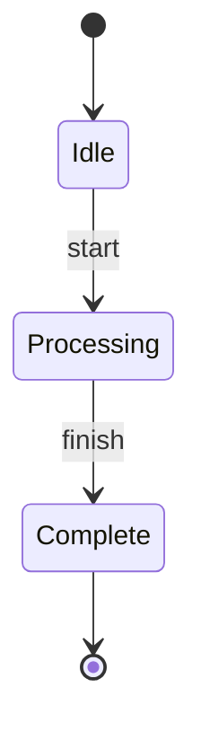

---

## States

### Simple States

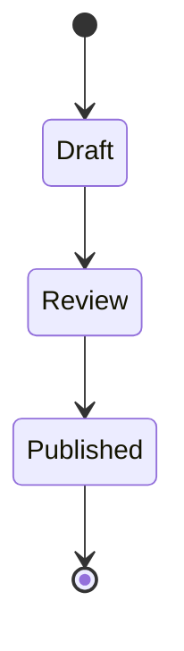

### State with Description

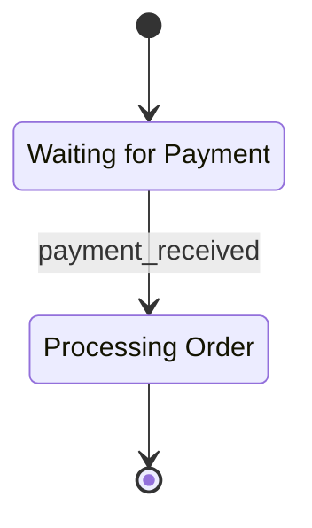

---

## Transitions

### Basic Transitions

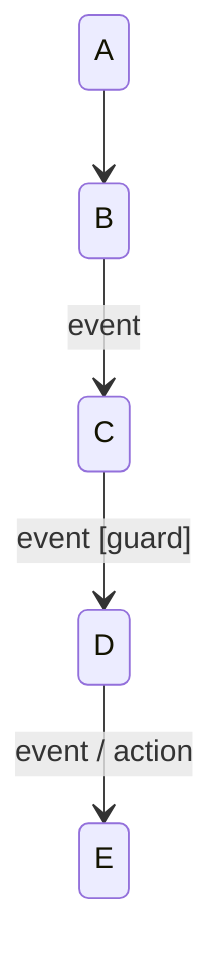

### Self-Transitions

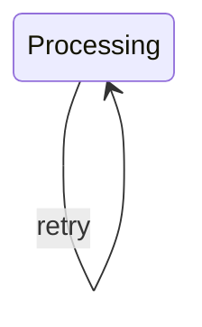

---

## Composite States

Nested states for complex behaviors:

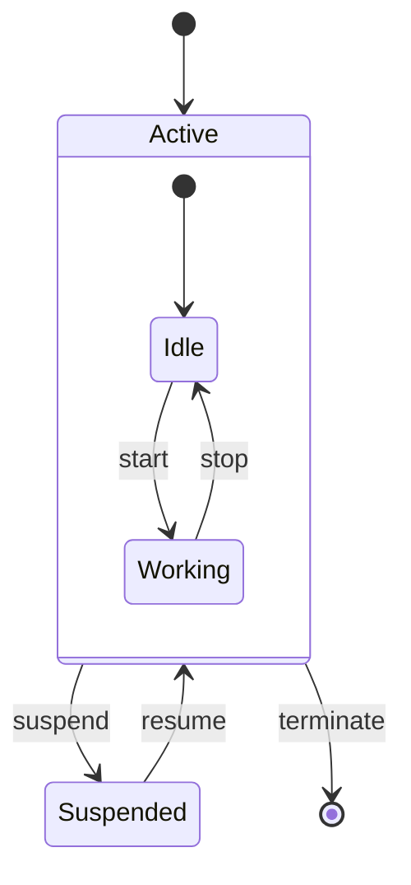

### Deeply Nested

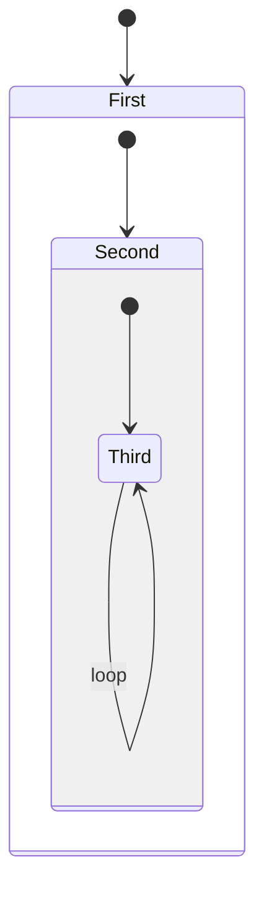

---

## Choice (Decision Points)

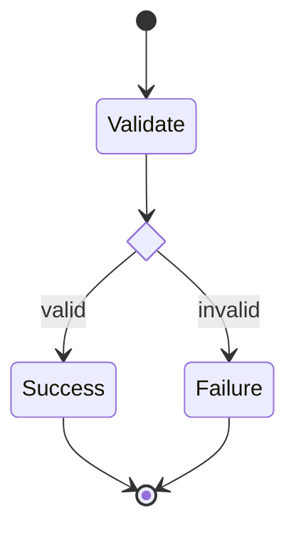

---

## Fork and Join (Parallel States)

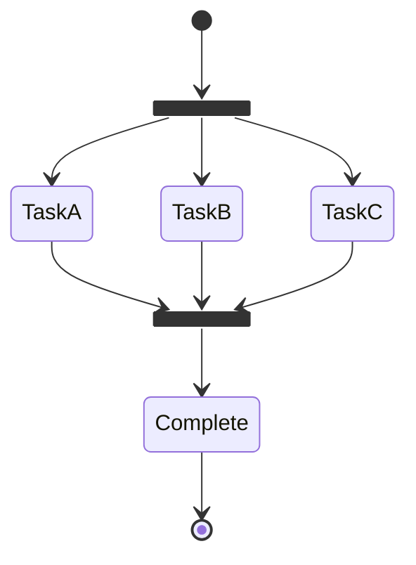

---

## Concurrent States

States that execute in parallel:

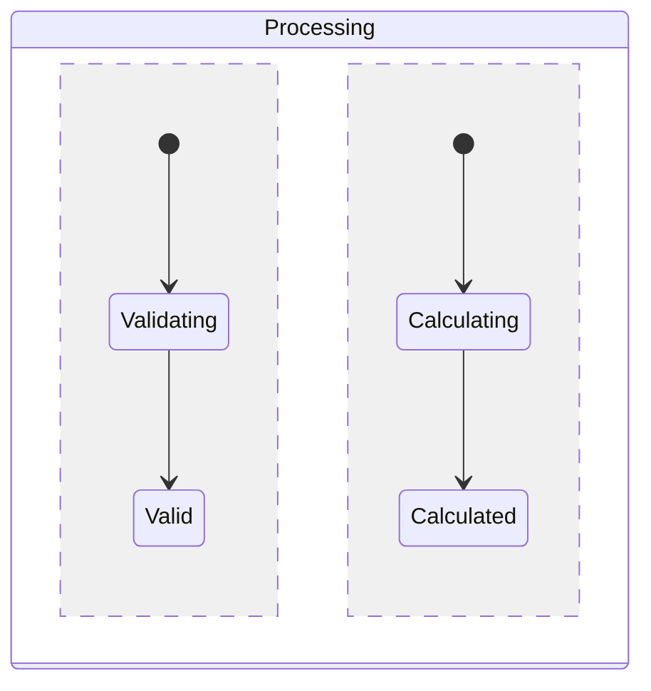

---

## Notes

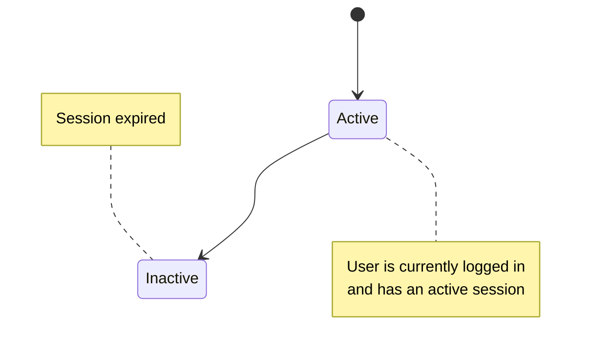

---

## Direction

Control layout direction:

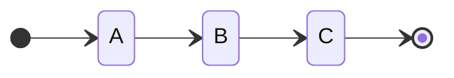

Options: `TB`, `BT`, `LR`, `RL`

---

## Styling

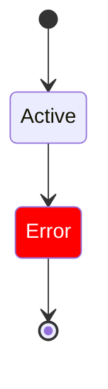

---

## Example: Order Lifecycle

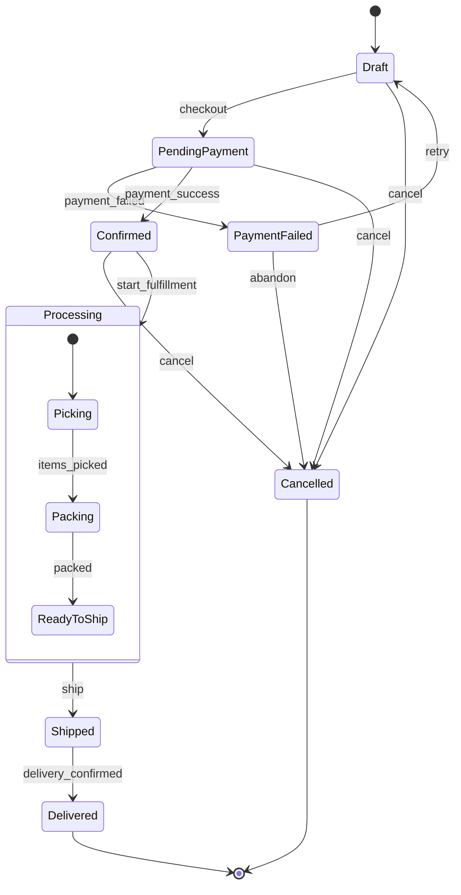

---

## Example: Connection State Machine

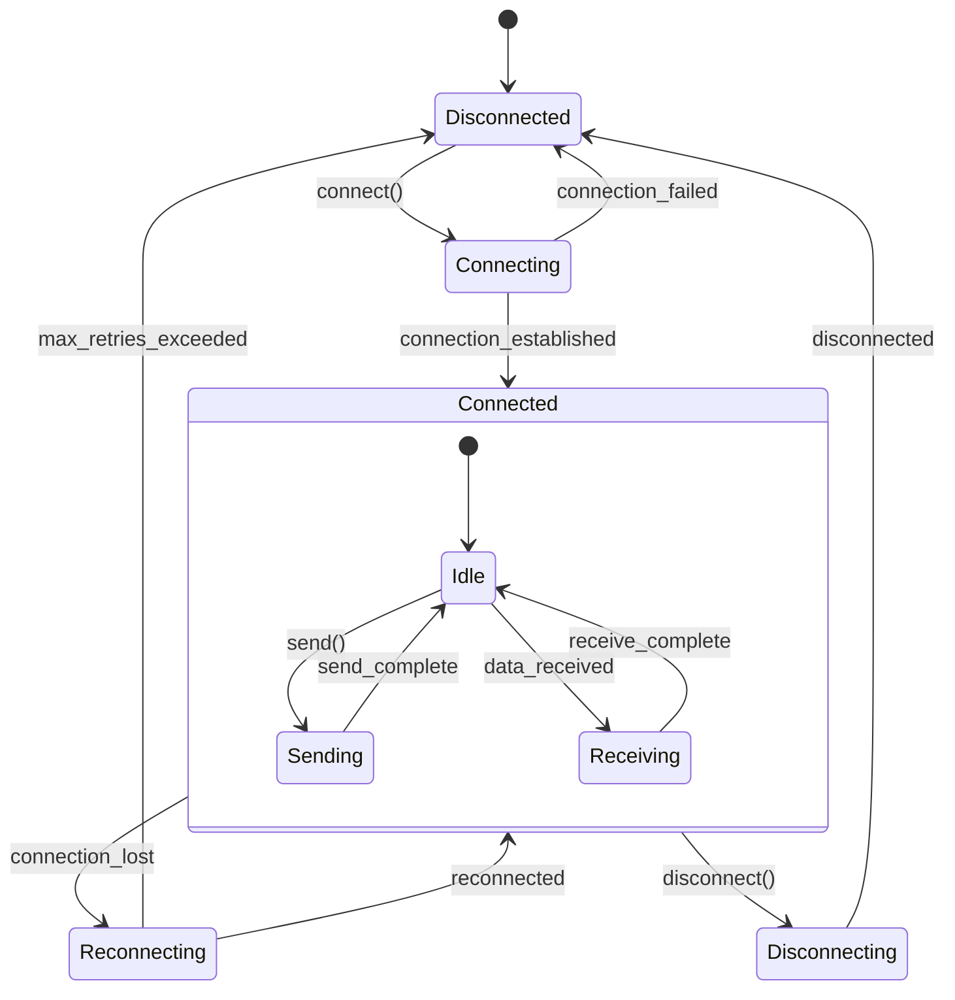

---

## Example: Authentication Flow

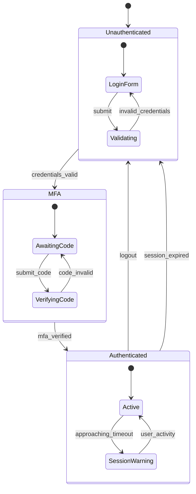

---

# User Journey Diagrams

## Basic Syntax

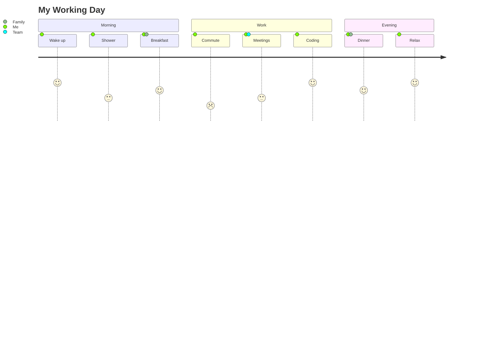

---

## Structure

### Title


### Sections

Group related tasks:

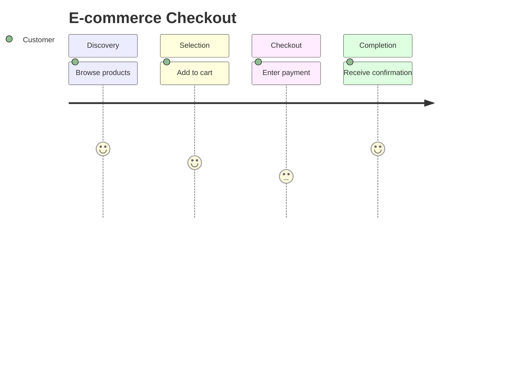

### Tasks

Format: `Task name: score: actor1, actor2, ...`

- **Score**: 1-5 (1 = negative, 5 = positive)
- **Actors**: Participants involved

---

## Example: SaaS Onboarding

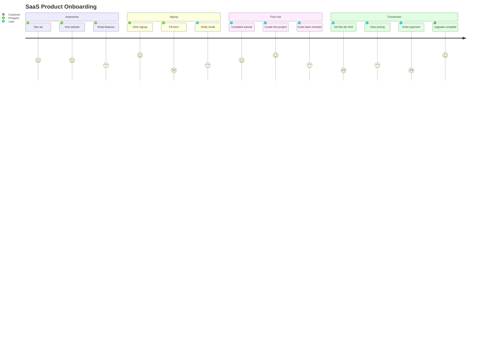

---

## Example: Support Ticket Journey

```mermaid
journey
    title Customer Support Experience
    section Issue Discovery
        Encounter problem: 1: Customer
        Search help docs: 3: Customer
        Cannot find solution: 2: Customer
    section Contact Support
        Find contact form: 3: Customer
        Describe issue: 4: Customer
        Submit ticket: 4: Customer
    section Resolution
        Receive acknowledgment: 4: Customer, Support
        First response: 5: Customer, Support
        Follow-up questions: 3: Customer, Support
        Issue resolved: 5: Customer, Support
    section Post-Resolution
        Receive survey: 3: Customer
        Leave feedback: 4: Customer
```

---

## Example: Mobile App First Launch

```mermaid
journey
    title Mobile App First Launch Experience
    section Download
        Discover app: 4: User
        Read reviews: 4: User
        Download app: 5: User
    section Onboarding
        Open app: 5: User
        View splash screen: 3: User
        Skip/watch intro: 4: User
        Grant permissions: 2: User
    section Account Setup
        Choose signup method: 4: User
        Complete profile: 3: User
        Set preferences: 4: User
    section First Session
        View main screen: 5: User
        Complete first action: 5: User
        Receive achievement: 5: User
    section Retention
        Receive push notification: 3: User
        Return next day: 4: User
```

---

## Use Cases

### When to Use User Journey

1. **UX Research** - Map current user experience
2. **Identify Pain Points** - Find low-score areas
3. **Design Improvements** - Plan better experiences
4. **Stakeholder Communication** - Visualize user perspective
5. **Service Design** - Map multi-touchpoint experiences

### Tips

- Keep scores realistic (not all 5s)
- Include multiple actors when relevant
- Use sections to group related activities
- Focus on emotional experience, not just tasks
- Identify opportunities at low-score points
